Wanna launch your React app fast and easy, with the option to scale? These serverless hosting solutions can help you go live in a jiffy, deploy updates on a dime, and slash the cost of delivering your app to users.


So you built a React app, but you’re not sure how or where to host it. In this article, we’ll walk you through 8 free React app hosting services, show you how we deployed [this React app](https://github.com/nikolalsvk/bank-website) using each one, and tell you what we learned in the process.

We built our app in Figma using the [Anima](http://animaapp.com?utm_source=designer-advocate&utm_medium=social&utm_campaign=seo&utm_content=free-react-app-hosting-services) plugin, which allowed us to add functionality, insert [live, customizable React components](https://www.animaapp.com/blog/product-updates/react-component-library-in-figma/?utm_source=designer-advocate&utm_medium=social&utm_campaign=seo&utm_content=free-react-app-hosting-services) from Recharts and AntDesign, and export dev-ready React code for the entire UI. It took us a day to build.

Learn how we built our React banking app (and connected our own data using Strapi’s headless CMS) [here](https://www.animaapp.com/blog/design-to-code/fullstack-react-app-figma-strapi-anima/?utm_source=designer-advocate&utm_medium=social&utm_campaign=seo&utm_content=free-react-app-hosting-services).

## Where to host your React app for free

There are a growing number of serverless hosting solutions out there thanks to the rise of component-based frameworks like React. Amazon AWS, Microsoft Azure, and Google Cloud are currently the dominant platforms. However, there’s a growing shift towards dedicated frontend hosting services that require less effort, and can get you up and running in no time—and most include CI/CD. Here are the 8 free React app hosting services we tested:

1\. [Netlify](#netlify)

2\. [Vercel](#vercel)

3\. [AWS Amplify](#aws-amplify)

4\. [Firebase](#firebase)

5\. [GitHub Pages](#github-pages)

6\. [GitLab Pages](#gitlab-pages)

7\. [Render](#render)

8\. [Surge](#surge)

Let’s dive into these free React app hosting services in more detail, and demonstrate how we deployed a React app using each one.

### Netlify

#### Background

Netlify was founded in 2014 and it focused from the start on hosting static websites. It attracted a lot of developers because of its generous free tier. A couple of years down the line, Netlify grew to be one of the most popular JAMstack and static website hosts around.

#### How to use

1.  Ideally, you’ll register or sign in with GitHub. This makes sure you can access the repositories on your profile and deploy them quickly.
2.  Once logged in, click “Add new site” and choose “Import an existing project.” 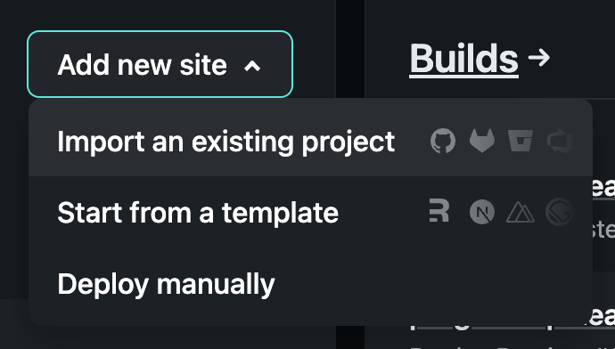
3.  Then click GitHub as your provider. 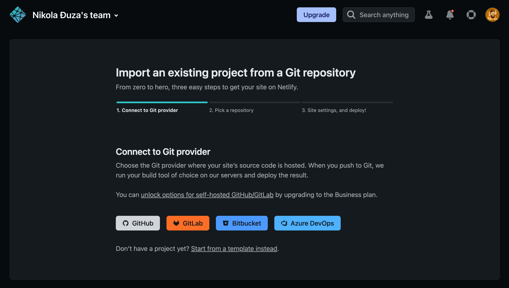
4.  Pick the “bank-website” or whatever your project name is. 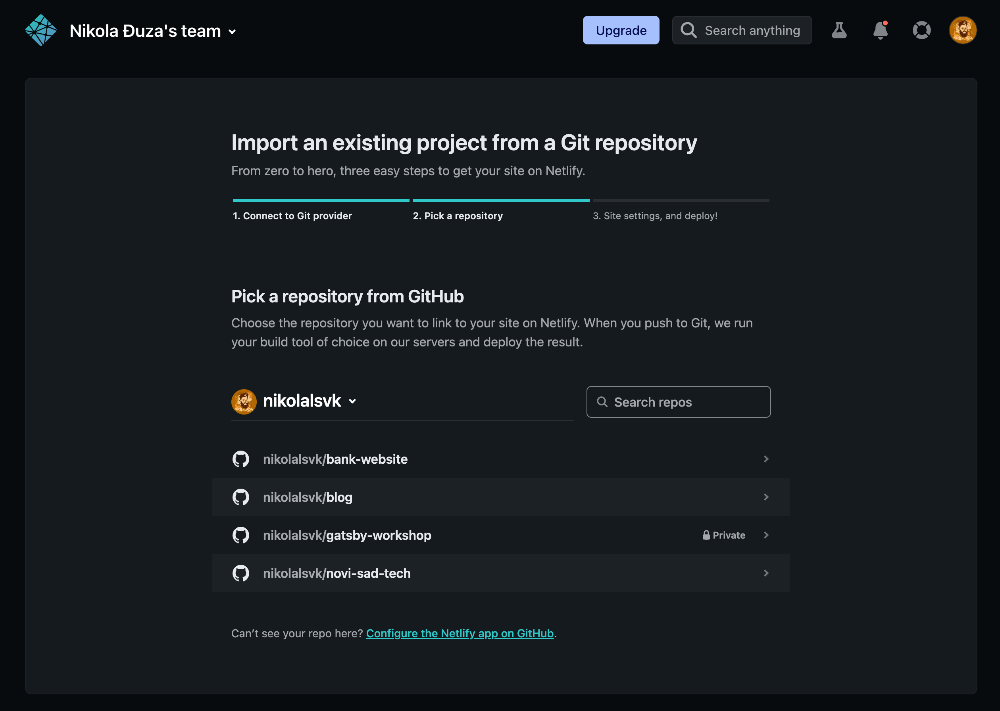
5.  Fine-tune the deployment settings (in the case of our website, the defaults work perfectly), then click “Deploy site.” 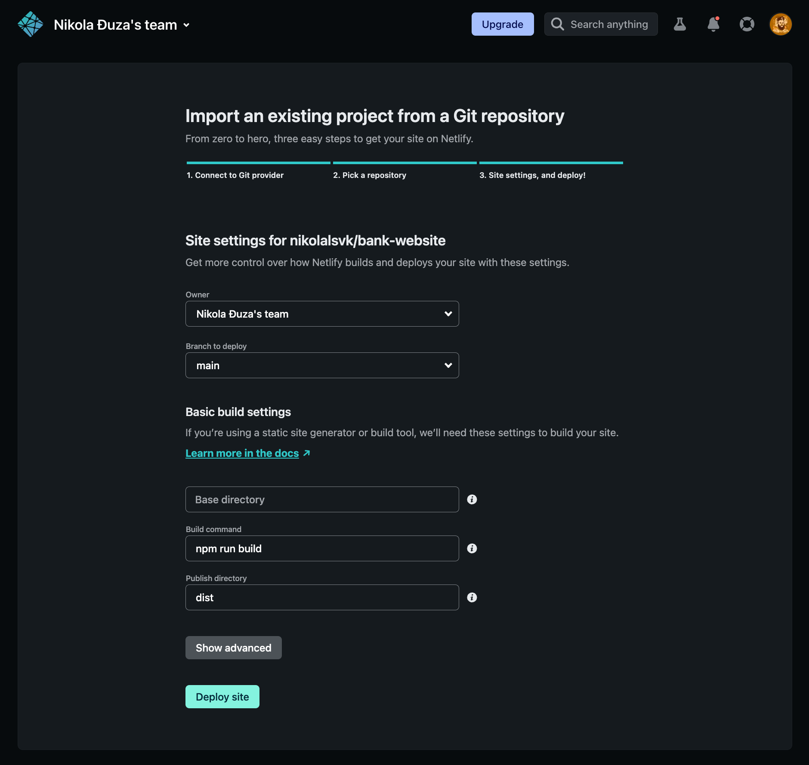
6.  Once deployed, you can view it on a public URL which you can share with the world. Yay! 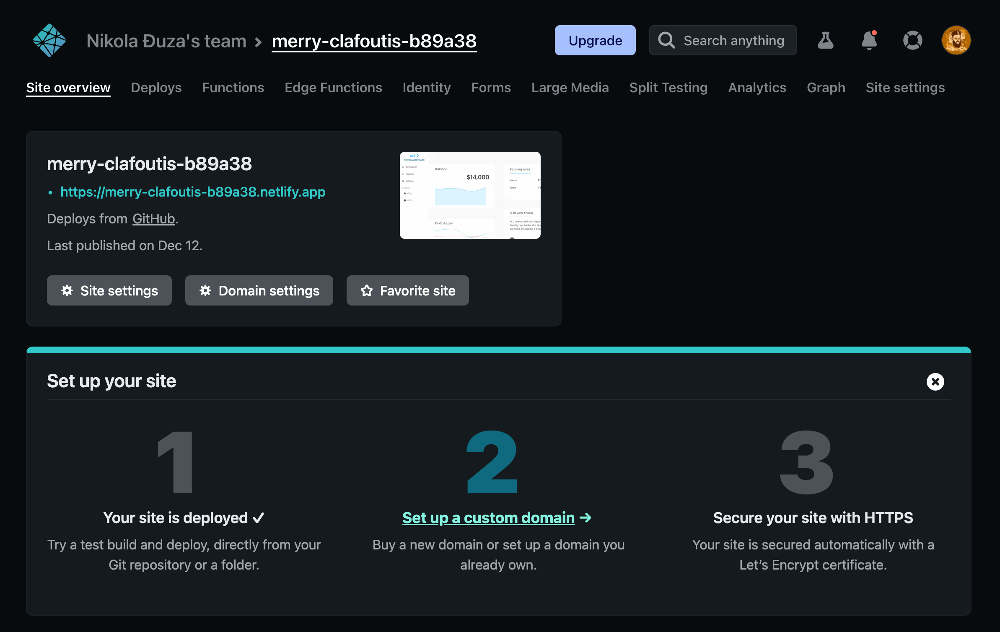

[Here’s](https://merry-clafoutis-b89a38.netlify.app/) the live app deployed on Netlify.

#### Pros and cons

Netlify is easy to set up and deploy, not to mention that is one of the fastest services we tested here. One downside is that if you need collaborators and/or a team, you must upgrade to a paid plan.

### Vercel

#### Background

Vercel (originally known as Zeit) was founded in 2015 and quickly rose to fame. They are the maintainers of Next.js, a popular React framework for building websites. They offer a free tier to non-commercial websites, as well as ways to use their Edge network for serverless functions.

#### How to use

1.  Sign in or register with GitHub. 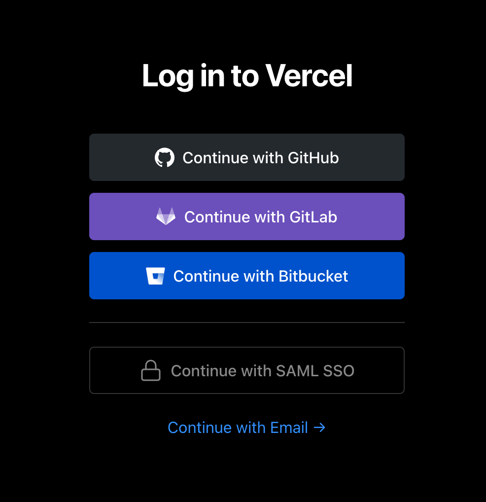
2.  Click on the “Add New…” dropdown and select “Project.” 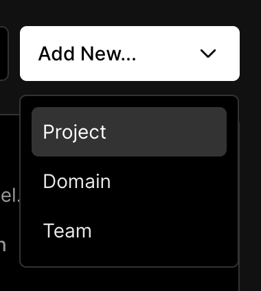
3.  Choose the “bank-website” or your favorite React project. 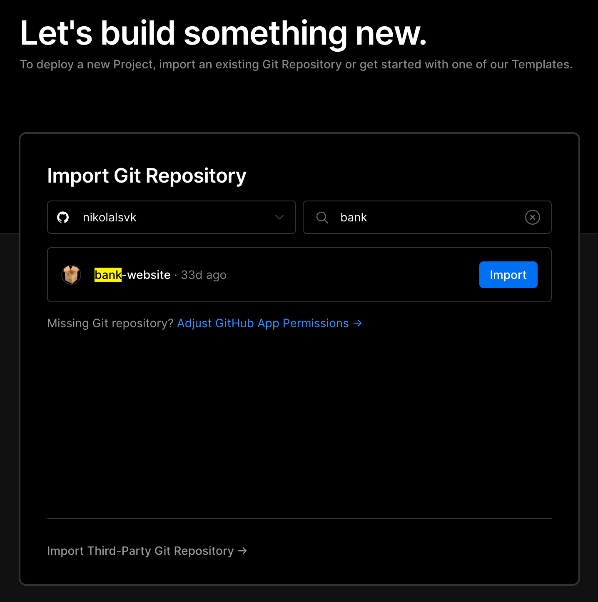
4.  We went with the defaults for deployment settings and then clicked “Deploy.” 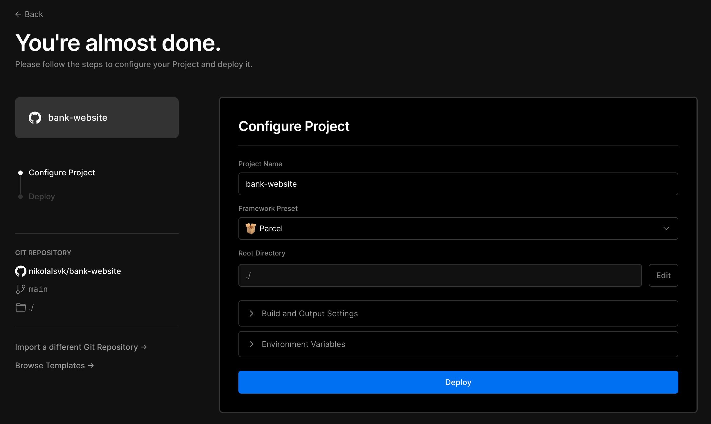

5.  After some time, we got the website deployed. 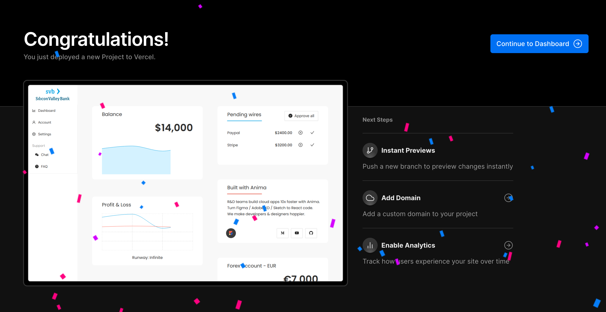

[Here’s](https://bank-website-chi.vercel.app/) the live URL.

#### Pros and cons

Vercel needs some time to cache the installation part of the deployment process, but after that, it is one of the fastest services. It shows preview deploys for every branch you push and it does it quickly because of caching.

### AWS Amplify

#### Background

AWS is a massive collection of cloud products, and Amplify is advertised as an easy way to get a hold of some of them. With AWS Amplify, you can quickly build, ship, and host full-stack applications on AWS, with the flexibility to leverage the breadth of AWS services as use cases evolve.

#### How to use

1.  Sign up or log into AWS, then search for AWS Amplify and click “Get Started.”
2.  Choose GitHub and authorize it (I only allowed it for the “bank-website” repo). 
3.  Select the repo in the “Recently updated repositories” section. 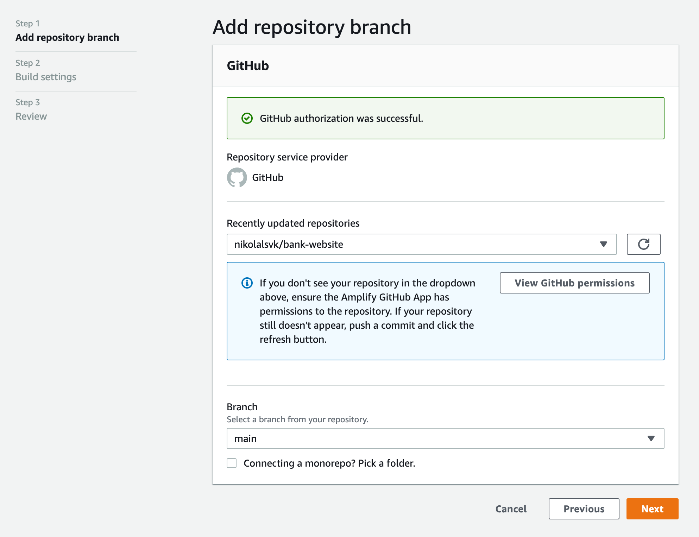
    3.1. In the build setting, we’ll have to change the `baseDirectory` for our app to be `dist` like so: 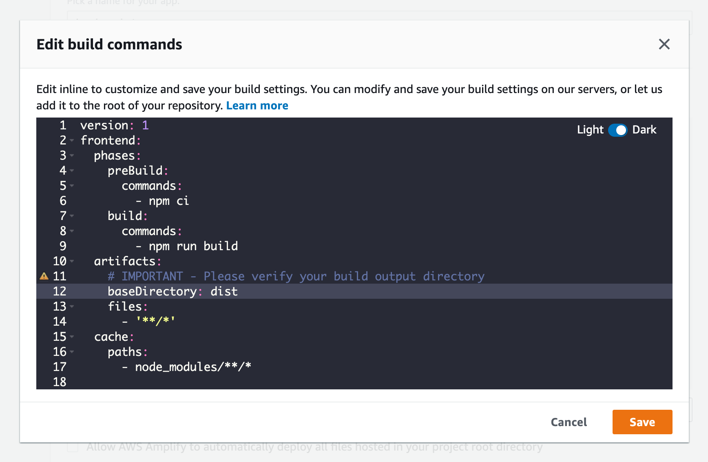
    Then, the build settings should look like this: 
4.  In the next step, click “Save and deploy.” 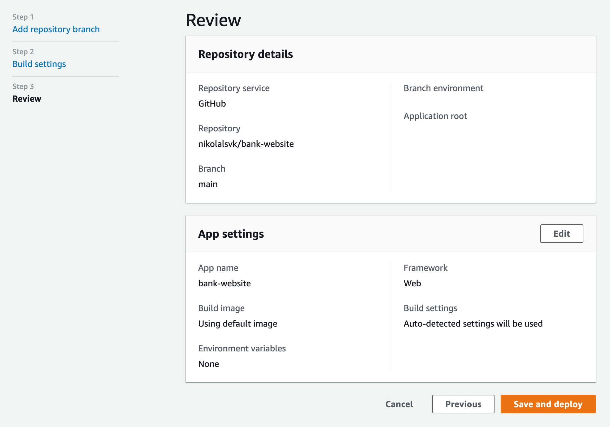
5.  After some time, the website will be deployed and ready to use. 

And we’re live! [Here’s](https://main.d6docw6y29xiw.amplifyapp.com/) the URL.

#### Pros and cons

You have to edit the `baseDirectory` in the deployment specification—it’s not recognized out of the box. The UI feels a bit clunky, but this is a personal preference. There is a huge potential for AWS Amplify because a lot of other AWS web services are within arm’s reach.

### Firebase

#### Background

Firebase is a Google service that’s best known as a real-time storage platform. But it also has a hosting option for static websites and Express.js microservices or APIs, and supports preview URLs for branches your team is working on. As with Netlify, Vercel, and others, it serves the deployed content over a CDN network.

#### How to use

1.  Install `firebase-tools` with `npm install -g firebase-tools`.
2.  Log into Firebase with `firebase login`. Once you log in, you should see a message like this one: 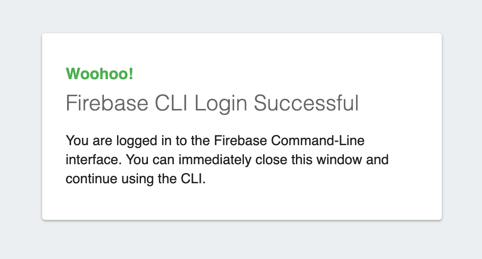
3.  Move into the project directory and run `firebase init`, you should see something like this:

```bash
$ firebase init

     ######## #### ########  ######## ########     ###     ######  ########
     ##        ##  ##     ## ##       ##     ##  ##   ##  ##       ##
     ######    ##  ########  ######   ########  #########  ######  ######
     ##        ##  ##    ##  ##       ##     ## ##     ##       ## ##
     ##       #### ##     ## ######## ########  ##     ##  ######  ########

You're about to initialize a Firebase project in this directory:

  /Users/nikola/Documents/playground/bank-website

? Which Firebase features do you want to set up for this directory? Press Space to select features, then Enter to confirm your choices. (Press <space> to select, <a> to toggle all, <i> to invert selection, and <enter> to proceed)

 ◯ Realtime Database: Configure a security rules file for Realtime Database and (optionally) provision default instance
 ◯ Firestore: Configure security rules and indexes files for Firestore
 ◯ Functions: Configure a Cloud Functions directory and its files
❯◯ Hosting: Configure files for Firebase Hosting and (optionally) set up GitHub Action deploys
 ◯ Hosting: Set up GitHub Action deploys
 ◯ Storage: Configure a security rules file for Cloud Storage
 ◯ Emulators: Set up local emulators for Firebase products

(Move up and down to reveal more choices)
```

Choose the option to configure files for Firebase Hosting with optional GitHub Action deploys. Then, you can create a project straight from the CLI or use Firebase UI to do it and later connect it. We created the project from the command line, and this is how we answered the resulting questions:

```bash
? What do you want to use as your public directory? dist
? Configure as a single-page app (rewrite all urls to /index.html)? Yes
? Set up automatic builds and deploys with GitHub? No
? File dist/index.html already exists. Overwrite? No
```

After that, simple `firebase.json` and `.firebaserc` files will be created.

4. Then, run `firebase deploy` to actually deploy the files from the `dist` directory. If the directory is missing, make sure to run `npm run build` first to generate files. The `firebase deploy` command should generate output similar to the example below:

```bash
=== Deploying to 'bank-website-6678'...

i  deploying hosting
i  hosting[bank-website-6678]: beginning deploy...
i  hosting[bank-website-6678]: found 10 files in dist
✔  hosting[bank-website-6678]: file upload complete
i  hosting[bank-website-6678]: finalizing version...
✔  hosting[bank-website-6678]: version finalized
i  hosting[bank-website-6678]: releasing new version...
✔  hosting[bank-website-6678]: release complete

✔  Deploy complete!

Project Console: https://console.firebase.google.com/project/bank-website-6678/overview
Hosting URL: https://bank-website-6678.web.app
```

Now you can [view the website](https://bank-website-6678.web.app) on the URL provided. Yay!

#### Pros and cons

Firebase is fairly simple, but when you set up it up inside your project, the questions you need to answer are a bit confusing. Luckily, we answered them for you in the section above, but they require an understanding of the actual Firebase features before proceeding. Other than that, Firebase is quick to deploy and can generate a URL where you can preview the deployed files. You can also easily automate it with GitHub Action deployments with the CLI, which is neat.

### GitHub Pages

#### Background

GitHub Pages has been around for quite some time and it’s an easy way to publish docs or a personal website directly from GitHub. It’s lovely for static content and a lot of folks use it to deploy simple sites with minimal investment. It’s free to use if your project is public and is a fast and cheap way to host a website.

#### How to use

Please note you have to edit the App.jsx where we call Router and add basename to it to match the repo name. So this is how App.jsx should look:

```jsx
import "./App.css"
import React from "react"
import { Switch, BrowserRouter as Router, Route } from "react-router-dom"
import SVBHome from "./components/SVBHome"

function App() {
  return (
    <Router basename="/bank-website">
      <Switch>
        <Route path="/:path(|svb-home)">
          <SVBHome />
        </Route>
      </Switch>
    </Router>
  )
}

export default App
```

We have to change the `basename` because GitHub pages will deploy the website to a URL of this form **https://GITHUB_USERNAME.gitlab.io/REPO_NAME**. The website won’t function properly without the `basename` set for the `react-router-dom`.

1.  After the code changes, we need to install `gh-pages` package with:

```bash
npm install --save gh-pages
```

2.  And, add a `predeploy` and a `deploy` script to `package.json`:

```json
{
  // ...
  "scripts": {
    "start": "parcel index.html",
    "build": "parcel build index.html --public-url ./",
    "predeploy": "npm run build",
    "deploy": "gh-pages -d dist"
  }
  // ...
}
```

3.  Then, we simply run `npm run deploy`. It will trigger `npm run build` and it will use `gh-pages` to publish the contents of dist to a separate branch on GitHub called `gh-pages`.

4.  Finally, check whether the `gh-pages` is used for GitHub Pages like below: 

[Here’s](https://nikolalsvk.github.io/bank-website/) the live URL.

#### Pros and cons

If you’re deploying a project that differs from your username, it will be deployed inside a subdirectory on our free domain withing GitHub. Then, you need to write extra code to support the logic of being inside a subdirectory.

It does not support continuous deployment out-of-the-box in our use case, but you can set it up. Once set up, it is quick to deploy changes.

### GitLab Pages

#### Background

Like GitHub, GitLab has its own hosting solution, and they call it GitLab Pages. I have to give it to them, it is easier to set up a continuous deployment to GitLab Pages than it is for GitHub Pages.

#### How to use

1.  Sign up or log into GitLab
2.  Add a repo to GitLab if you don’t have it there already. You can [fork the one I added there](https://gitlab-pages.com/nikolalsvk/bank-website) 
    Similar to GitHub Pages, you have to edit the `App.jsx` where we call `Router` and add `basename` to it to match the repo name. So this is the final change:

```jsx
import "./App.css"
import React from "react"
import { Switch, BrowserRouter as Router, Route } from "react-router-dom"
import SVBHome from "./components/SVBHome"

function App() {
  return (
    <Router basename="/bank-website">
      <Switch>
        <Route path="/:path(|svb-home)">
          <SVBHome />
        </Route>
      </Switch>
    </Router>
  )
}

export default App
```

We have to change the `basename` because GitLab pages will deploy the website to a URL of this form: **https://gitlab-pages_USERNAME.gitlab.io/REPOSITORY_NAME**. The website won’t function properly without the basename set for the `react-router-dom`.

3. Once you’ve edited and pushed the project to GitLab, go to Settings > Pages and you will be greeted with a four-step wizard to deploy the repo to GitLab Pages. 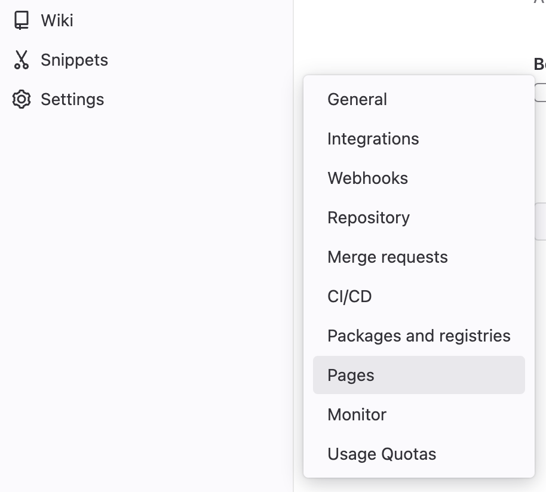

4. The first step in the wizard is to enter the build image. We’ll use the Node.js LTS. 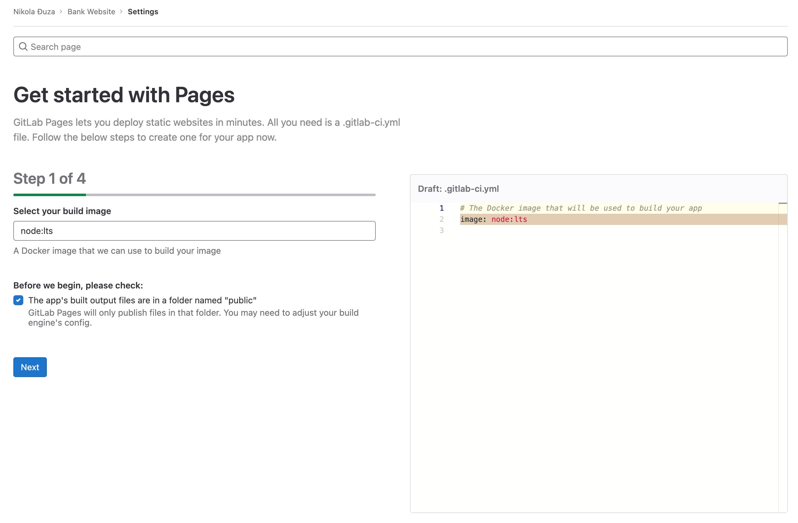

5. Next, we’ll enter the pre-build command. The `npm ci` will suffice here. 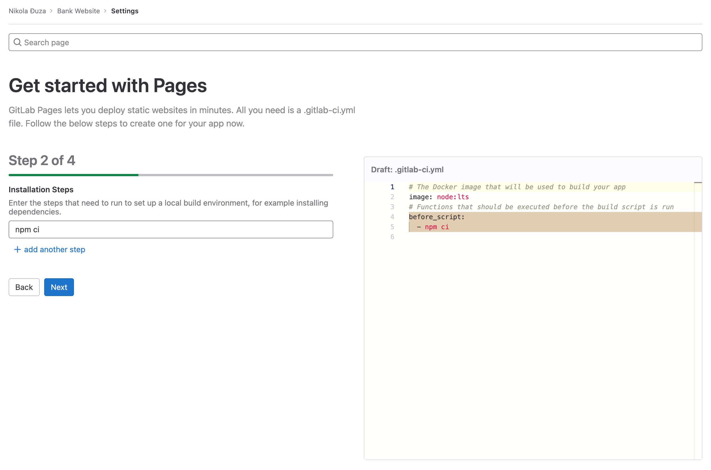

6. Now for the build step. We need to pass `— –dist-dir public` because GitLab Pages expect to have the website built in the `public` directory. You can’t get away with any other directory, sorry. 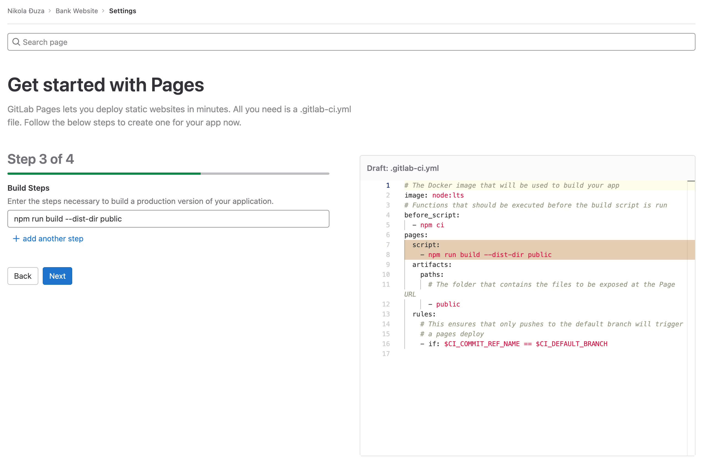

7. Commit the newly generated `.gitlab-ci.yml` file that tells GitLab how to deploy your website. 

8. Now, go to CI/CD -> Pipelines section of the repo and observe the newly added pipeline performing. 

9. After some time, the pipeline job will finish and the website will be deployed on GitLab Pages.

[Here’s](https://nikolalsvk.gitlab.io/bank-website/) the result.

#### Pros and cons

Packages are slow to install and you need to add extra code to get it working, but the wizard is super intuitive with only four steps to deploy.

### Render

#### Background

Render is a new kid on the block being launched in 2019. It is trying to disrupt the way folks deploy their services (including static websites). So far, they are doing fine and are growing in numbers.

#### How to use

1.  Sign up or log in to Render.
2.  Create a new static website by pressing the “New” button and selecting “Static Site.” 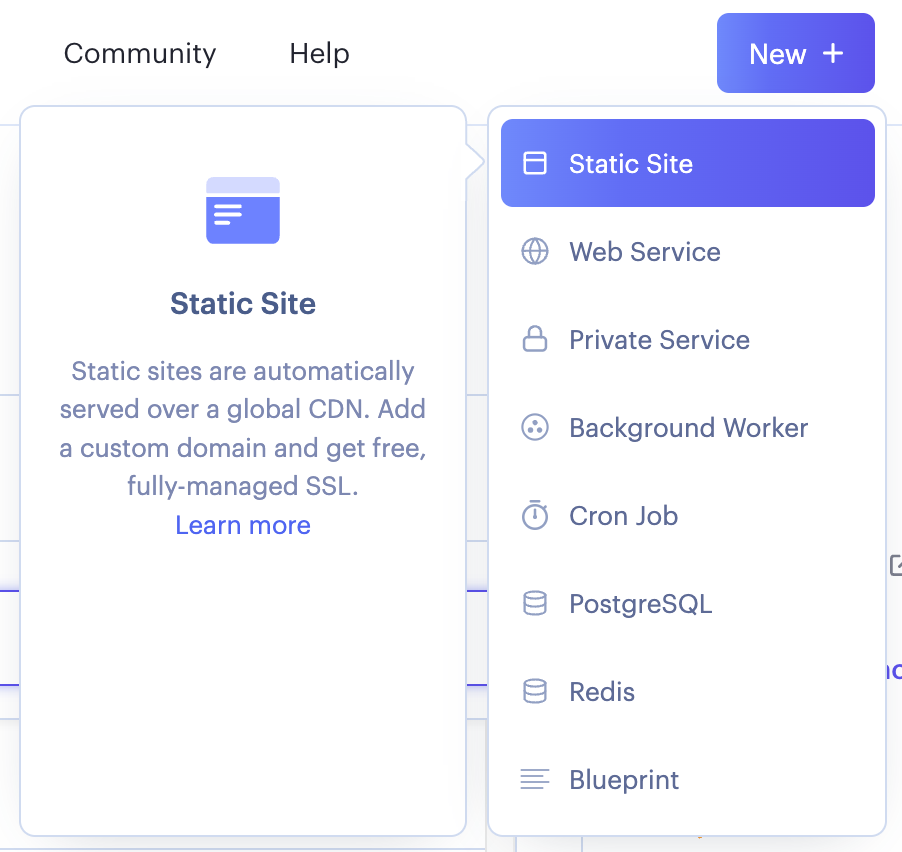
3.  Choose the repo you want to deploy. 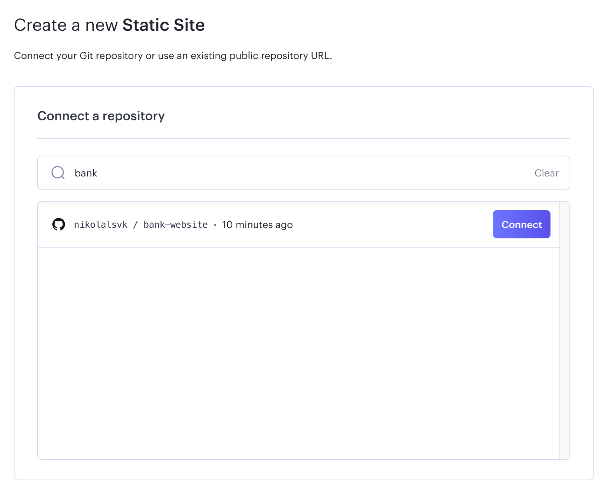
4.  Keep the `yarn; yarn build` build command in the build setting. Unfortunately, it does not work with `npm ci; npm run build` like other services do. Change the “Publish directory” to `dist` and click “Create Static Site.” 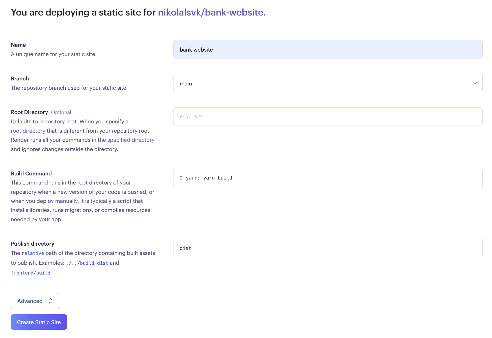
5.  After some time, Render will deploy the code. 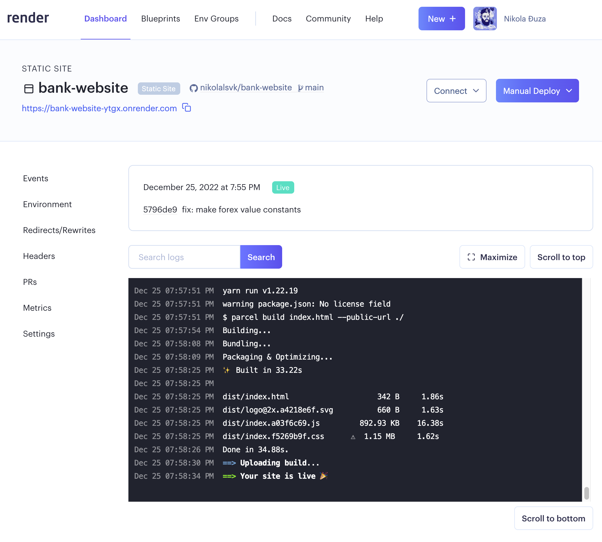

[Here’s](https://bank-website-ytgx.onrender.com/) the live URL from Render.

#### Pros and cons

It’s really fast, but it doesn’t work well for our project with `npm ci` and `npm run build` commands. Only `yarn` seems to work.

### Surge

#### Background

Surge has been around for some time now. Right of the bat, their service is simple to use and it only takes one or two commands to deploy your static website. It is free, but offers a paid plan of 30$/month. The stoicism of the tool is what makes it shine. No complex setup is needed, just install `surge` and run it with `surge`.

#### How to use

1.  To prepare, run `npm run build` to generate static files inside `dist` directory. The `surge` will use those for deployment.
2.  Run `npm install –global surge`
3.  Then, run `surge`.

A few things to note:
If it’s your first time running it, you’ll have to create an account with Surge. Don’t worry, it’s easy. Just input your email and desired password.

Then, you’ll get asked to input “project”, which should be the path to the `dist` directory. You can just append `dist` to the path you’re given if you ran surge inside the repo you’re deploying.

Then, input the future URL of your website. Try something unique because what `surge` offered didn’t work for me.

After the URL input, the `surge` will deploy contents from `dist` over to the specified URL. Here’s what I got:

```bash
$ surge

   Running as myemail@gmail.com (Student)

        project: .../bank-website/dist
         domain: bank-website-tryout.surge.sh
         upload: [====================] 100% eta: 0.0s (12 files, 14600007 bytes)
            CDN: [====================] 100%
     encryption: *.surge.sh, surge.sh (143 days)
             IP: 138.197.235.123

   Success! - Published to bank-website-tryout.surge.sh
```

#### Pros and cons

It’s fast and simple and doesn’t require you to adopt a separate interface—but it fails to suggest an available URL for your app.

## Time to deploy for each hosting service

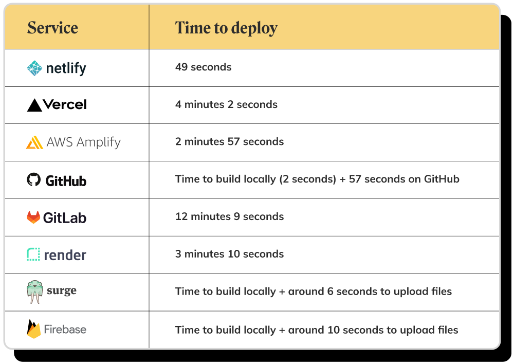

## Our favorite free React app hosting services

1.  Netlify
2.  Vercel
3.  Surge

## Key takeaways

After testing each of these free React app hosting services, we think Netlify is the best of the bunch. It provides quick deployments with lots of features you might need. Right after that is Vercel which has lots of features and is fairly quick after the initial deployment. Then, we have Surge which is a minimal deployment tool that can be fairly cheap if you decide to upgrade.
