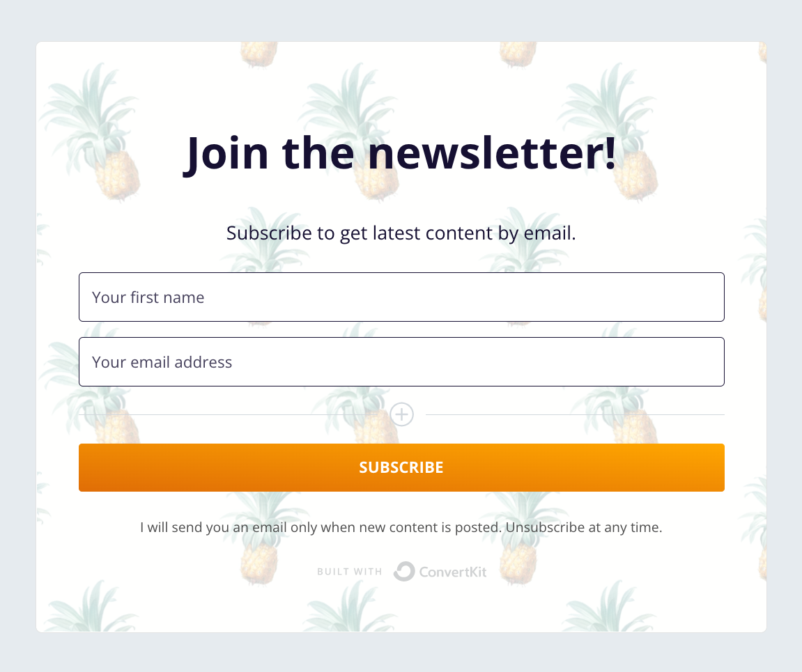
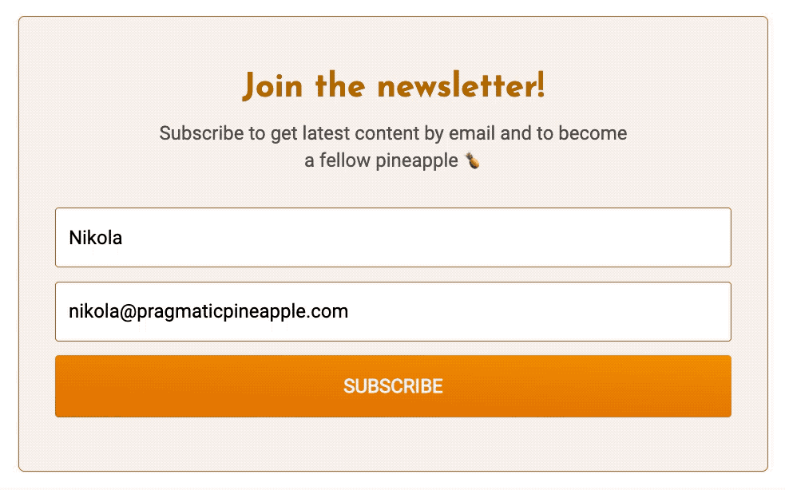
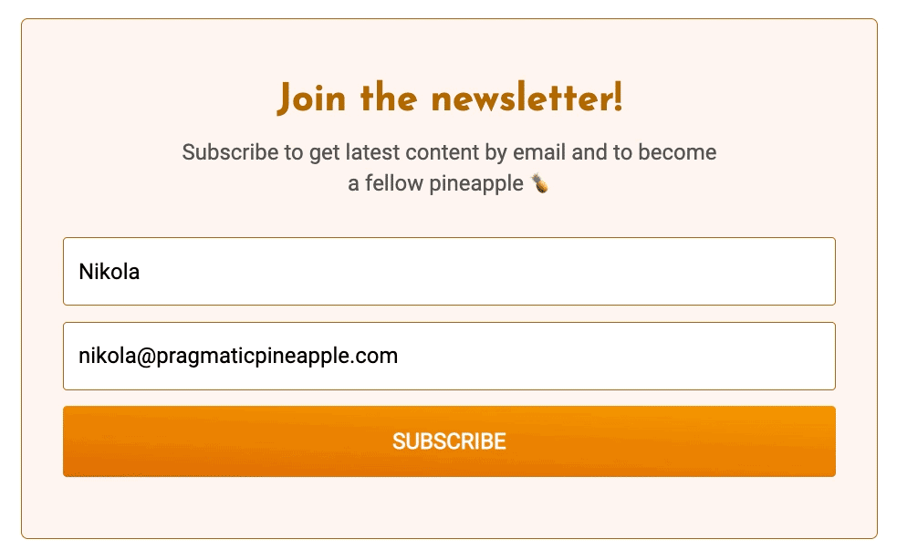

If you are a developer and do not like the fact of embedding 3rd party code senselessly into your website, this is a perfect post for you. We will go through the process of building a custom email sign-up form for your website so you can grow your audience. We will use React, but the same principles apply to any library or framework, like Gatsby or Next.js.

If you are someone returning to my blog, you might have noticed a small form on the bottom of pretty much any page. It is a form where you can sign up for my newsletter, and I've changed it a bit over the years. Below is how the form looks at the time of the writing:


At first, I used some out-of-the-box solutions given by various providers. I was most happy with [ConvertKit](https://convertkit.com?lmref=EVgZiQ), and its form looks, so I went with it for a while. I designed the form in [ConvertKit](https://convertkit.com?lmref=EVgZiQ)'s UI and embedded its HTML on my blog. Here's how it looked in the early days:



I was impressed by what you can achieve with their form builder, but being a developer, I was not too fond of copying a lot of code and styles that I know little about. Of course, I could have dived in the CSS and figured it out. And I had to do exactly that whenever I wanted to tweak the form looks. But I always wished to create a custom form with my styles and behavior that suits me.

So, without further ado, let us jump in and see how you can design and put a custom form that allows users to subscribe.

## Form layout

If you want to grow your newsletter, you probably need just a name and an email of the person signing up. Of course, you can go crazy and create this super duper long form, but the chances of people filling it and signing up for your newsletter are going to go down probably. But hey, who am I to stop you? Knock yourself out.

So to start, we can just build a simple HTML form with two input fields and a submit button. To remind you, I will show how this is done in the React context, but it should be pretty intuitive on how to do it in raw HTML or some other library/framework. Here's the JSX version:

```js
const SubscribeForm = () => {
  const [email, setEmail] = useState("")
  const [name, setName] = useState("")

  const handleSubmit = async (event: React.FormEvent) => {
    // TODO
  }

  const handleEmailChange = (event: React.ChangeEvent<HTMLInputElement>) => {
    const { value } = event.target
    setEmail(value)
  }

  const handleNameChange = (event: React.ChangeEvent<HTMLInputElement>) => {
    const { value } = event.target
    setName(value)
  }

  return (
    <form onSubmit={handleSubmit}>
      <input
        aria-label="Your first name"
        name="fields[first_name]"
        placeholder="Your first name"
        type="text"
        onChange={handleNameChange}
        value={name}
      />
      <input
        aria-label="Your email address"
        name="email_address"
        placeholder="Your email address"
        required
        type="email"
        onChange={handleEmailChange}
        value={email}
      />
      <button>SUBSCRIBE</button>
    </form>
  )
}
```

Congrats, you just saw a classic HTML form in React's implementation. A `form` tag, tied together by two `input`s and one `button`. But, let's not just jump over it. There's important info that will later help us when we submit data to [ConvertKit](https://convertkit.com?lmref=EVgZiQ). Please go back a look at two input fields and their names. The `fields[first_name]` and `email_address` will prove valuable in a second.

## Sending the data

OK, so we got the form rendering, but if you ship this form as is, no user will be able to subscribe and show up in the [ConvertKit](https://convertkit.com?lmref=EVgZiQ). To allow users to subscribe, we need to send data to [ConvertKit](https://convertkit.com/?lmref=EVgZiQ) by ourselves. Here's how we can do it in our `handleSubmit` function:

```jsx
const SubscribeForm = () => {
  ...
  const FORM_URL = `your form URL, we will describe it in a sec`

  const handleSubmit = async (event: React.FormEvent) => {
    event.preventDefault()

    const data = new FormData(event.target as HTMLFormElement)

    try {
      const response = await fetch(FORM_URL, {
        method: "post",
        body: data,
        headers: {
          accept: "application/json",
        },
      })
      const json = await response.json()

      if (json.status === "success") {
        return
      }
    } catch (err) {
      console.log(err)
    }
  }

  ...
}
```

Cool, we added the logic that makes a POST request to a `FORM_URL` with the form data, and we account for any errors that happen along the way. One thing we are missing here to be a full solution is a proper value for the `FORM_URL`. You can create your own by [creating a form on ConvertKit](https://help.convertkit.com/en/articles/3860348-how-to-create-your-first-form-in-convertkit?lmref=EVgZiQ).

Once you have the form created, copy the form ID from [ConvertKit](https://convertkit.com?lmref=EVgZiQ)'s form editor URL. For example, the URL where you edit your form can be something like this `https://app.convertkit.com/forms/designers/123456/edit`. The `123456` is your form ID. Then, you can tape together the `FORM_URL` to be `https://app.convertkit.com/forms/123456/subscriptions`.

You can also get it from [ConvertKit](https://convertkit.com/?lmref=EVgZiQ) when you try to embed your form. Go to the HTML option to embed, and there you will find something like this:

```html
<form action="https://app.convertkit.com/forms/123456/subscriptions" ...>
  ...
</form>
```

The `action` value is what you need to snatch and use in the custom form.

Now, do you remember those input name attributes we mentioned before? I'll remind you - we added the `fields[first_name]` and `email_address` to our input fields. These names will build a proper FormData object that ConvertKit expects. So we just mimicked what the embedded ConvertKit form does for us. Now, when the user clicks the "SUBSCRIBE" button, they will actually show up in [ConvertKit](https://convertkit.com/?lmref=EVgZiQ) as a subscriber. How neat.

We can now upgrade the user experience in the next section. Read on.

## Personal touches

Why would we build a custom form that does the same thing as the 3rd part one? Well, yes, we can better define its styles, and we have more control over what is shown to the user. But my reason to do all this was to add a bit more functionality to the form. For example, when you subscribe to my newsletter, you get a sweet transition that says thank you and mentions your name. It is definitely not necessary, but I find it charming and consider it a good user experience.

You can do it yourself as well, let us try it out in the example below:

```jsx
const SubscribeForm = () => {
  const [status, setStatus] = useState<string | null>(null)
  const [email, setEmail] = useState("")
  const [name, setName] = useState("")

  const FORM_URL = `the URL you created in the previous section`

  const handleSubmit = async (event: React.FormEvent) => {
    event.preventDefault()

    const data = new FormData(event.target as HTMLFormElement)

    try {
      const response = await fetch(FORM_URL, {
        method: "post",
        body: data,
        headers: {
          accept: "application/json",
        },
      })

      setEmail("")
      const json = await response.json()

      if (json.status === "success") {
        setStatus("SUCCESS")
        return
      }
    } catch (err) {
      setStatus("ERROR")
      console.log(err)
    }
  }

  const handleEmailChange = (event: React.ChangeEvent<HTMLInputElement>) => {
    const { value } = event.target
    setEmail(value)
  }

  const handleNameChange = (event: React.ChangeEvent<HTMLInputElement>) => {
    const { value } = event.target
    setName(value)
  }

  return (
    <div>
      {status === "SUCCESS" && (
          <p>
            Welcome aboard{name ? `, ${name}` : ""}{" "}
            <span role="img" aria-label="Ship">
              🚢
            </span>
          </p>
          <p>Please check your inbox to confirm the subscription!</p>
      )}
      {status === "ERROR" && (
          <p>Oops, something went wrong...</p>
          <p>
            Please,{" "}
            <button onClick={() => setStatus(null)}>try again.</button>
          </p>
      )}
      {status === null && (
          <form onSubmit={handleSubmit}>
            <input
              aria-label="Your first name"
              name="fields[first_name]"
              placeholder="Your first name"
              type="text"
              onChange={handleNameChange}
              value={name}
            />
            <input
              aria-label="Your email address"
              name="email_address"
              placeholder="Your email address"
              required
              type="email"
              onChange={handleEmailChange}
              value={email}
            />
            <button>SUBSCRIBE</button>
          </form>
      )}
    </div>
  )
}
```

We are doing a similar thing as before, except we added a `STATUS` of the form. It can be either `null`, `SUCCESS`, or `ERROR`. We render a different output for the user based on those three values. Here's how I did it on my blog when a user is subscribed:



And here is how it's done when something bad happens:



But don't trust the GIFs I posted. Try it out yourself and sign up for [my newsletter](/newsletter) at the bottom of this blog post and let me know what you think of the signing up experience.

## Summing up

Having control and a final ask on what you put on your website is great. It can help you customize how it shows and behaves, which is not something that is not often available. In this blog post, we showed how to set up your own form for a newsletter so users can sign up with a few extra touches.

My blog is open-source, and you can find this form (but with styling) on [the blog repo here](https://github.com/nikolalsvk/blog/blob/master/src/components/subscribe-form.tsx). Pull requests, stars, and suggestions are welcome and encouraged.

If you liked it, I dare you to do it on your website but add a little bit of flair, maybe some animations if you're into that. If you're interested in seeing more `content like this, consider subscribing to the [newsletter](/newsletter) we mentioned a couple of times.

I want to do a similar blog post, creating a custom showing of tweets. Usually, you copy the code from Twitter and paste it on your site to embed tweets. I plan to build something to show tweets myself, so I don't load a lot of Twitter code. Stay tuned for that.

All in all, thanks for tuning in and following this blog post. Share it with your friends and coworkers on Twitter if you find it useful:

TODO

Until the next one, cheers.
