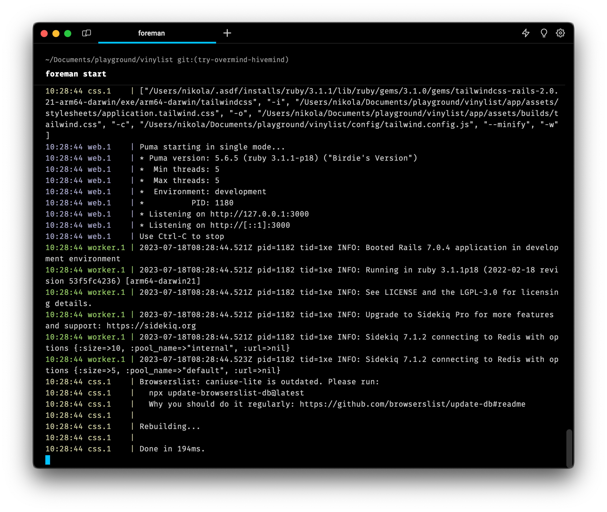
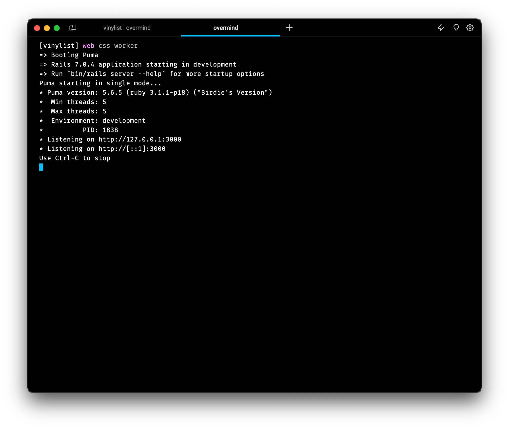

<figure>

<figcaption class="photo-caption">
Photo by <a href="https://unsplash.com/@arstyy?utm_source=unsplash&utm_medium=referral&utm_content=creditCopyText">Austin Neill</a> on <a href="https://unsplash.com/s/photos/control?utm_source=unsplash&utm_medium=referral&utm_content=creditCopyText">Unsplash</a>
</figcaption>
</figure>

If you're wondering how to run multiple processes in your project, look no further. You came to the perfect place where you'll learn how to quickly and effectively run all the services your project needs.

Forget about opening multiple tabs in your terminal and typing out several commands. Today, you'll harness the power of running everything with a single command.

## The Procfile

Welcome to the `Procfile` file - a place where all your project's services are defined. The `Procfile` is a place where you define one or more processes to be run in order for your app to function. In short, this is how a `Procfile` I use looks:

```
web: bin/rails server -p 3000
css: bin/rails tailwindcss:watch
worker: bundle exec sidekiq
```

There, we have three processes defined:

1. `web` - the Rails web server. This can be any command that runs your project main logic.
2. `css` - the Tailwind development server.
3. `worker` - the Sidekiq process that handles scheduled jobs.

You can name these however you want, there are no rules to this. Use what makes sense to you and your team/coworkers.
The `Procfile` is usually stored in the root of the project, and sometimes, you can have multiple of these. But, for the sake of simplicity, we'll use just one for now and explain later how to use multiple files.

So, what now? How do you run processes after you've defined them in the `Procfile`? Glad you asked, this is where Overmind steps in.

## Overmind - The Process Runner

Most folks would reach out to the Foreman tool to run their processes via `Procfile`. Today, we'll show a better way to do it with a tool called Overmind.

Overmind is a tool written by [DarthSim](https://github.com/DarthSim) and you can view its code at [this GitHub repo](https://github.com/DarthSim/overmind). It is highly inspired by Foreman we mentioned before, but it solves a couple of problems Foreman (and other tools) have. The problem with most of other tools is that processes you want to manage start to think they are logging their output into a file, and that can lead to all sorts of problems: severe lagging and losing or breaking colored output. Tools can also add vanity information (unneeded timestamps in logs).

Overmind uses `tmux` under the hood to bring out some useful features, so we need to install that first with:

```bash
# on macOS (with homebrew)
$ brew install tmux

# on Ubuntu
$ apt-get install tmux
```

> 🤫 Psst, do you want to learn tmux the easy way? Here's a [Gentle Guide to Get Started With tmux](/gentle-guide-to-get-started-with-tmux) I wrote to help you do that.

Great, now let's install Overmind:

```bash
# on macOS (with homebrew)
brew install overmind

# or by using Go
go install github.com/DarthSim/overmind/v2
```

Awesome, now that we have Overmind install, we can move to the root of our project and start all those process with a single command:

```bash
overmind start
```

For me, this is how the output looks:


Right there, you can see all the output nicely rendered, with the famous Sidekiq ASCII art printed out.

If we quickly compare that to an output `foreman` does with `foreman start`, we'll see a different output:



The output is not as nice as with Overmind.

But that's not all. We did manage to start processes defined in `Procfile` successfully and see the output, let's now see the real deal of Overmind, let's bring in **more power** with it!

## Mo Powa Babeh

<figure align="center">

<figcaption class="photo-caption">More Power, Baby from Donut's James Pumphrey</figcaption>
</figure>

What makes Overmind great for me is that you can easily connect to any of the processes that you're running. Yeah, you could have a similar thing if you opened a couple of tabs and ran every command on its own, but we're not here for that, duh...

Overmind uses `tmux` - a terminal multiplexer under the hood. Do not worry, you won't have to learn another tool (except maybe two or three commands). By having tmux under the hood, we can easily run `overmind connect` and it will shoot us straight into a tmux session with our processes.

Try out:

```bash
overmind connect
```

Here's what I got:



I got launched into the first process defined in `Procfile` - the `web` process. The connect feature is very powerful because it allows you to see the logs of all processes split into tabs in tmux. You can easily switch tabs with `Ctrl + b` and the number of a tab. For example:

1. `Ctrl + b` and then 1, switches you to the `web` process,
2. `Ctrl + b` and then 2, switches you to the `css` process,
3. and you get the idea.

While inside the tmux session with Overmind, you can also control debug process if you run a debugger in any of the processes. For example, I put a debugger statement in my Rails controller like so:

```rb
class PublicController < ApplicationController
  def index
    debugger
  end
end
```

And when I visit the home page, my `web` process stops until I interact with the debugger. To make the `web` process move forward, I quickly type `overmind connect web` and continue the debugger.


And now, to gently exit the session without killing processes, use the `Ctrl + b` and then `d`. Congrats, you just learned how to switch windows in tmux and how to exit a tmux session 👏.

But what if you're a tmux user already and all you do in the terminal is inside tmux? What if you do `overmind connect` inside a tmux session? Let's find out

## Overmind in tmux

Let's say you're already using tmux for your day-to-day endeavors and you ran `overmind connect` - what now? How do you exit without killing everything Overmind is running? First, here's how that looks:


At the top, you can see I have the `overmind` window open in tmux. Then, below it, you see three windows with `web`, `css`, and `worker` open. The trick here is to do the double `Ctrl + b` and then `d`. So do `Ctrl + b` `Ctrl + b` and then `d`. This will tell the second instance of tmux (the one ran by Overmind) to detach from the session. Now, you should be back to the tmux window you were before running `overmind connect` like so:


OK, but what else can I do in Overmind? Glad you asked - I'll show you a couple of more features.

## More Overmind features

You can restart processes easily. Let's say you made some changes to the web server that requires you to restart it. Here's how to do it:

```bash
overmind restart web
```

You can stop something with:

```bash
overmind stop worker
```

And if all goes wrong, just kill the whole thing with:

```bash
overmind kill
```

One more thing I promised at the beginning - the multiple `Procfile` situation. In some teams and projects, there are more than one `Procfile`. Usually, they are called `Procfile` and `Procfile.dev`. One serves for production, other for development. Or whatever other combination you can think of. To be able to run Overmind with a file like `Procfile.dev`, you need to do it like so:

```bash
overmind start --procfile Procfile.dev

# or a shorter version
overmind s -f Procfile.dev
```

Also, there are more options and features to explore over at the official docs in [Overmind's GitHub repo](https://github.com/DarthSim/overmind).
There is an alternative to Overmind, especially if you don't need all those features. It is called Hivemind.

## Hivemind - Overmind's little sister

If you don't want all those features and want something to run all the processes, consider [Hivemind](https://github.com/DarthSim/hivemind) from the same author.

You can get it with:

```bash
# on macOS with homebrew
brew install hivemind

# Or from source with Go 11
GO111MODULE=on go get -u -f github.com/DarthSim/hivemind
```

After that, you can run `hivemind` and that's it. Of course, that's all you get, there are no extra features like in Overmind. Here's how the output looks:


## Wrapping Up

Thanks for reading this far, you've just got introduced to a couple of concepts:

- `Procfile`- a file to define processes needed to run your project
- `foreman`- a tool to run those processes quickly
- [Overmind](https://github.com/DarthSim/overmind) - a tool that better prints out logs and has advanced features to help you easily manage processes
- [Hivemind](https://github.com/DarthSim/hivemind) - a smaller sibling of Overmind
- [tmux](https://github.com/tmux/tmux) - a terminal multiplexer that can increase your productivity locally and/or remote servers

So I hope you had a good time reading. And remember, these are tools made to make you feel and be more productive. Try them out, or don't, but I know, if you're a true terminal junkie, you're always on the lookout to saw a keystroke or two.

Until the next one, cheers!
