## Introduction

With AWS Elastic Beanstalk, you can quickly deploy and manage applications in the AWS cloud without having to worry about the infrastructure that supports those applications. AWS Elastic Beanstalk automatically handles all the details of application version history, capacity provisioning, load balancing, scaling, and application health monitoring.

This tutorial explains how to set up continuous deployment for your Node.js application on Elastic Beanstalk using Semaphore. First, we will initialize an environment on the Elastic Beanstalk console and add some changes to the configuration of our Node.js application. After that, we will show you how to set up deployment on Semaphore.

## Prerequisites

Before starting, you will need to do the following:

- Create an [AWS account](http://aws.amazon.com/)
- Add your project to Semaphore. Go [here](https://semaphoreci.com/docs/adding-github-bitbucket-project-to-semaphore.html) to learn how.

## Initializing an Elastic Beanstalk Environment

An Elastic Beanstalk application is a logical collection of Elastic Beanstalk components, including environments, versions, and environment configurations. In Elastic Beanstalk, an application is conceptually similar to a folder. An environment is a version that is deployed onto AWS resources. Each environment runs only one application version at a time.

## Creating an Application

The first step we need to take is to create an application on the [Elastic Beanstalk console](https://console.aws.amazon.com/elasticbeanstalk/home?). In the upper right corner, select the region in which you would like to create the Elastic Beanstalk application.

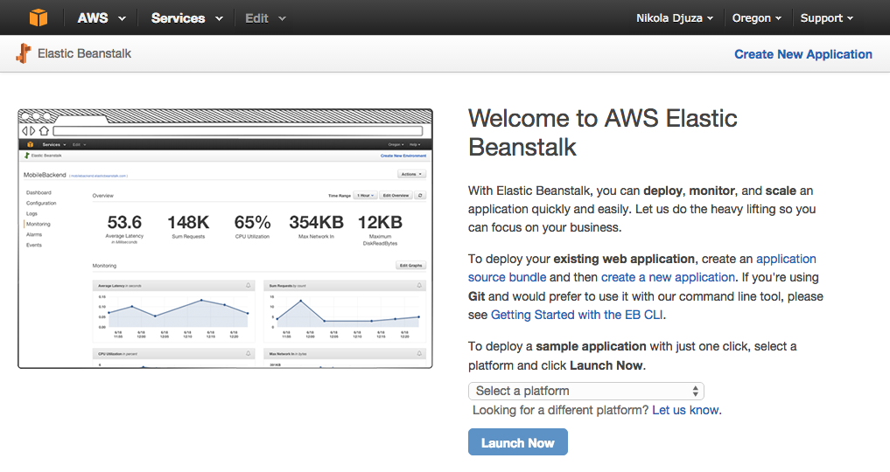

Next, click on “Create New Application” and choose a name for your Elastic Beanstalk application.

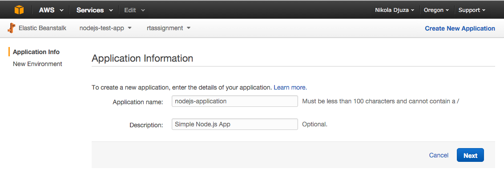

You can also do this from the command line:

```bash
$ aws elasticbeanstalk create-application --application-name nodejs-application
```

## Creating the Environment

The next step is to create an environment. Choose the “Create web server” option.

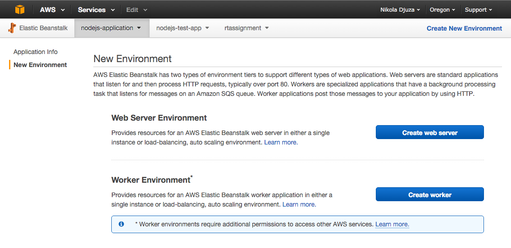

Your predefined configuration should be set to Node.js. For the time being, you can choose “Single instance” as your environment type. You can upgrade to the load-balancing, autoscaling environment once the application is ready for production.


You can select “Sample application” for the initial application version. This is just a temporary Elastic Beanstalk application, which we will use to check whether our configuration is correct.

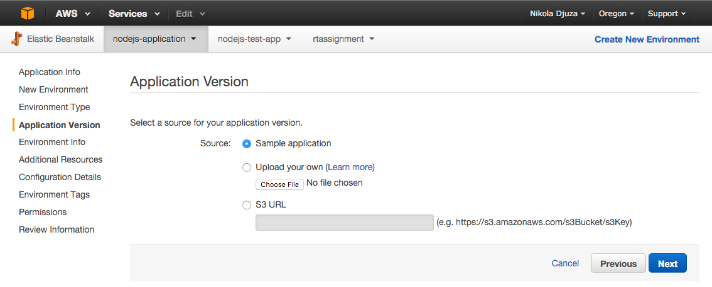

Next, you will need to choose a URL for your application and check its availability.


If your application requires a database, you will need to add an RDS DB instance. For more information on how you can configure your database for deploying to Elastic Beanstalk, you can visit the [AWS Elastic Beanstalk documentation for using Amazon RDS with Node.js](http://docs.aws.amazon.com/elasticbeanstalk/latest/dg/create_deploy_nodejs.rds.html).


Next, you need to enter the configuration details, as shown in the screenshot below. Adding the EC2 keypair is optional, but you may need it later for additional configuration, and you can’t add a keypair to a running instance without stopping it. If you don’t have an EC2 keypair, you can learn how to create one [here](http://docs.aws.amazon.com/AWSEC2/latest/UserGuide/ec2-key-pairs.html#having-ec2-create-your-key-pair). You may also prefer to import your own public key created using a third-party tool instead. You can do so by following [these instructions](http://docs.aws.amazon.com/AWSEC2/latest/UserGuide/ec2-key-pairs.html#how-to-generate-your-own-key-and-import-it-to-aws).

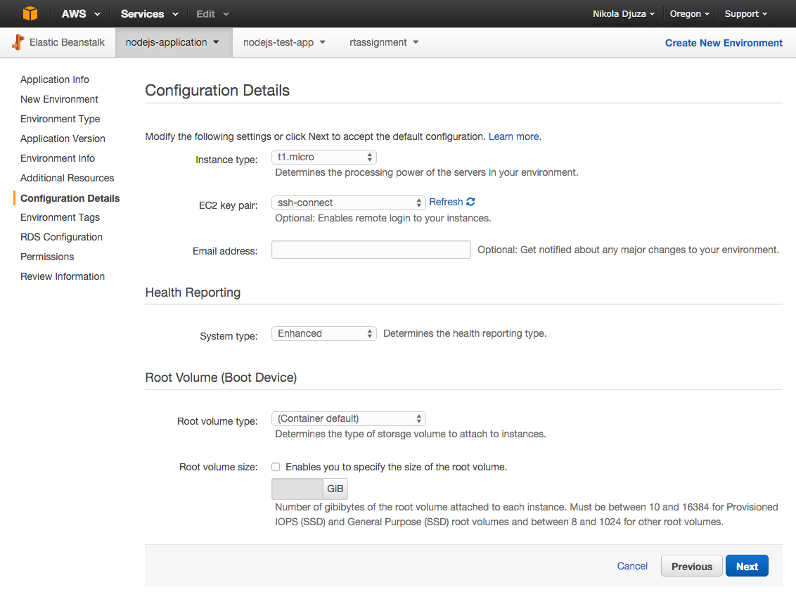

When creating a new environment, you can specify tags to categorize the environment. Tags can help you identify environments in cost allocation reports, which is especially useful if you have many to manage. These are optional, so we’ll leave these fields empty.


In this example, we are using MySQL as our DB engine, but you can choose your own from the select box “DB engine”.

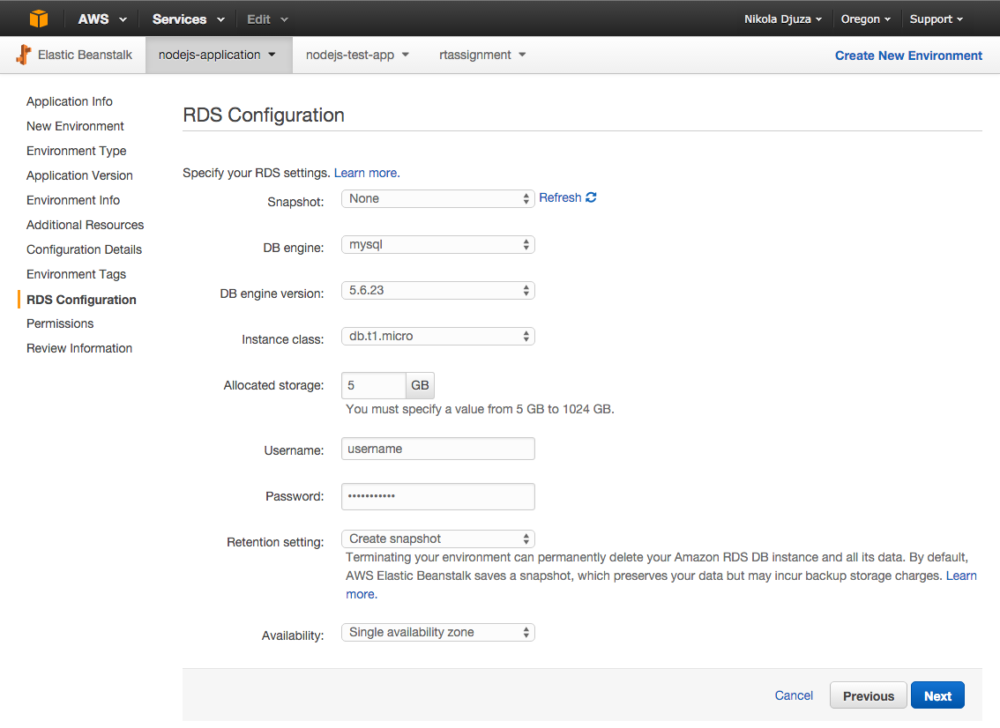

The last step is to define permissions for your environment. When you create a new environment, AWS Elastic Beanstalk prompts you to provide two AWS Identity and Access Management (IAM) roles, a service role, and an instance profile.

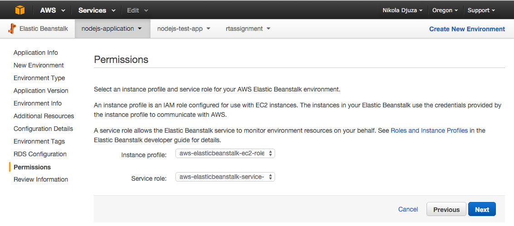

A role is essentially a set of permissions that grant access to actions and resources in AWS. An instance profile is a container for an IAM role that you can use to pass role information to an EC2 instance when the instance starts. This allows the Elastic Beanstalk service to monitor environment resources on your behalf. You can read more about permissions in the [Elastic Beanstalk documentation](https://docs.aws.amazon.com/elasticbeanstalk/latest/dg/concepts-roles.html).

For most environments, the service role and instance profile that the AWS Management Console prompts you to create with 1-click role creation when you launch your environment include all of the permissions you need. We will use those in our example.

The final step is to review the information and confirm it. Once you’ve clicked “Launch”, the environment should start initializing. If you have selected the option to create a RDS database, this process can take a while.

You can also create an Elastic Beanstalk environment from your command line using the following commands:

```bash
$ aws elasticbeanstalk create-environment --application-name nodejs-application --environment-name nodejs-application-env --version-label version-1 --solution-stack-name "64bit Amazon Linux 2015.03 v2.0.1 running Node.js"
```

The solution stack name determines your server configuration. We are using `"64bit Amazon Linux 2015.03 v2.0.1 running Node.js"`, but you can explore other options that can be listed using the following command:

```bash
$ aws elasticbeanstalk list-available-solution-stacks
```

When the environment status turns green, you can click the URL on the console. If it takes you to the welcome screen of the sample application, that means that your environment has been properly configured.

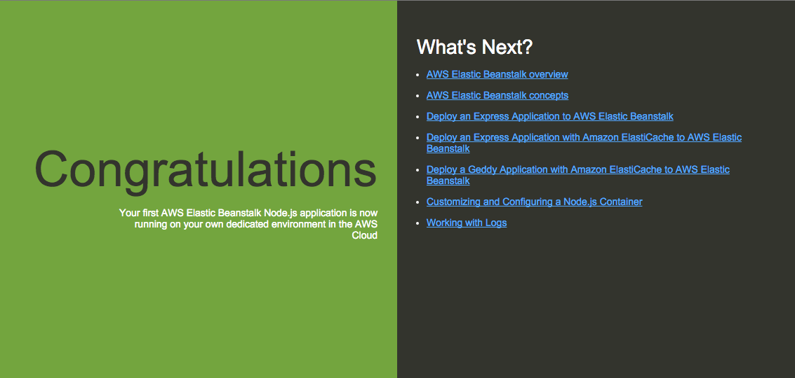

## Retrieving Security Credentials

Before moving on to deployment, you will need to retrieve security credentials, which you will use to provide Semaphore with access to your application. You can get your credentials by clicking on your name in the upper right corner of Elastic Beanstalk management console, and selecting “Security credentials”.

Click on “Users” in the left navigation bar and create a new user. Choose a name for your user, download the credentials, and store them somewhere safe — you will need those to configure Semaphore in one of the following steps.

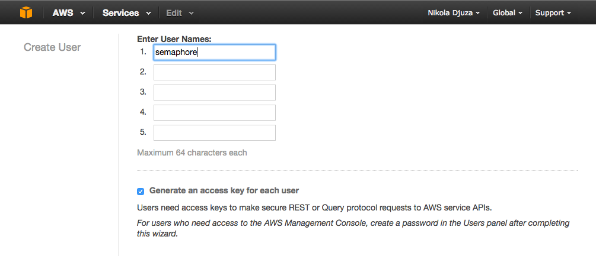

Next, you need to define a set of permissions for the newly created user. These are the permissions you will delegate to Semaphore in order to deploy your application.

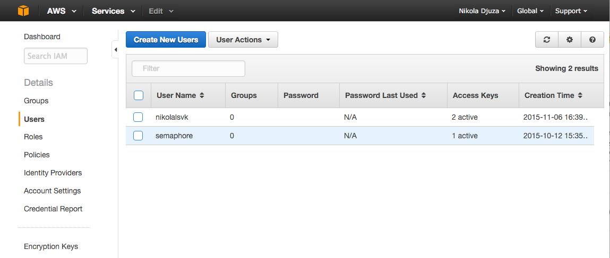

In the users list, click on the previously created user. AWS uses managed policies to define these permissions. A policy can be attached to a user or a group. If you have many users, groups provide an easy way to manage their permissions. However, if this is the first time you are using Elastic Beanstalk, and you just want to try it out, you can attach a policy straight to your user.

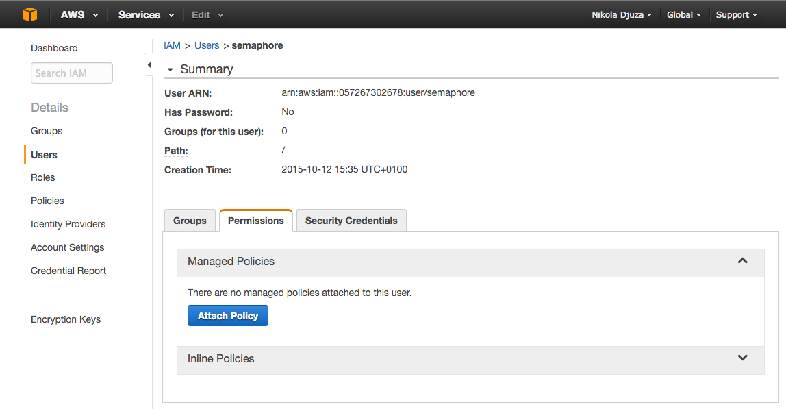

The “Attach Policy” button under “Permissions” will take you to a page listing predefined AWS policies. Select the `ElasticBeanstalkFullAccess` policy.

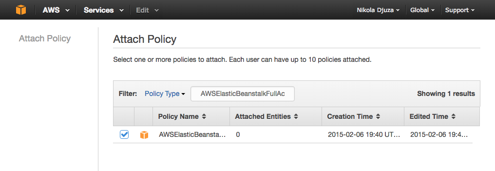

## Deploying the Application with Semaphore

Now that you’ve initialized your environment and configured your Node.js application, it’s time to finally deploy it. Go to the [Semaphore home page](https://semaphoreci.com/), log in, find your project, and add a new deployment server. Select the Elastic Beanstalk deployment server.

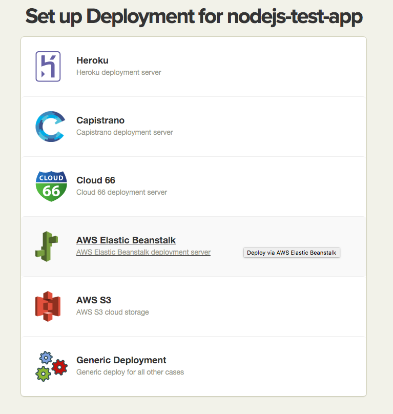

## Choosing the Deployment Strategy

For the purpose of this tutorial, we will use the Automatic deployment strategy. This means that every successful build on the branch you choose will launch a deploy. There is also the Manual deployment strategy, which allows you to choose when to deploy a specific branch. If needed, you can later change the deployment strategy in server settings.

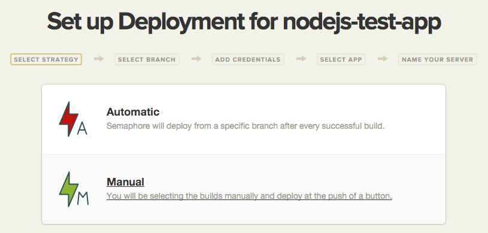

Next, you need to choose the branch you wish to deploy.

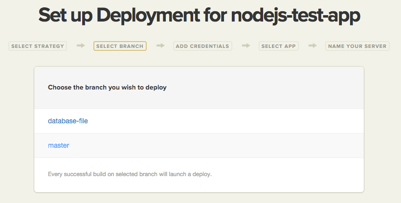

## Entering the AWS Credentials

Enter the AWS credentials you retrieved in the “Security Credentials” step of this tutorial and select the region. This will enable Semaphore to list the application and the environments you have in the region you specified.

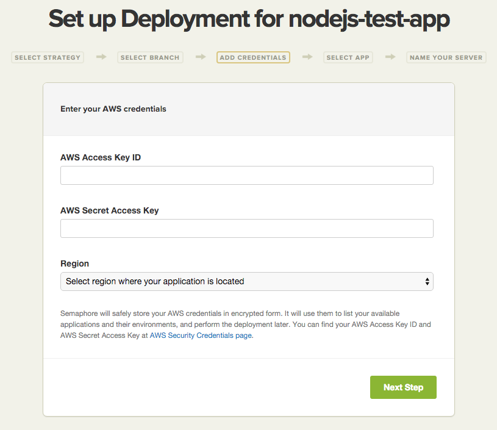

## Selecting the Application and the Environment

Next, you will need to select your target application and environment. In this example, we see that Semaphore found nodejs-application and its environment. You will also need to select the S3 bucket where your project .zip file will be uploaded. This is where Elastic Beanstalk will look for your application files.

In this tutorial, we are assuming that you are using the default Elastic Beanstalk deployment process. However, the same setup on Semaphore will also work if you are using Elastic Beanstalk with Docker in a [single container environment](http://docs.aws.amazon.com/elasticbeanstalk/latest/dg/docker-singlecontainer-deploy.html).

You can use the bucket named something similar to `elasticbeanstalk-us-west-2-057267302678`, which should have been created when you created the Elastic Beanstalk application. You can also select some other bucket with a more descriptive name. You can also create a new S3 bucket by clicking the “Create new S3 Bucket” link. Alternatively, you can go to the [S3 Management Console](https://console.aws.amazon.com/s3) and create one there, and then hit refresh on the Semaphore page.

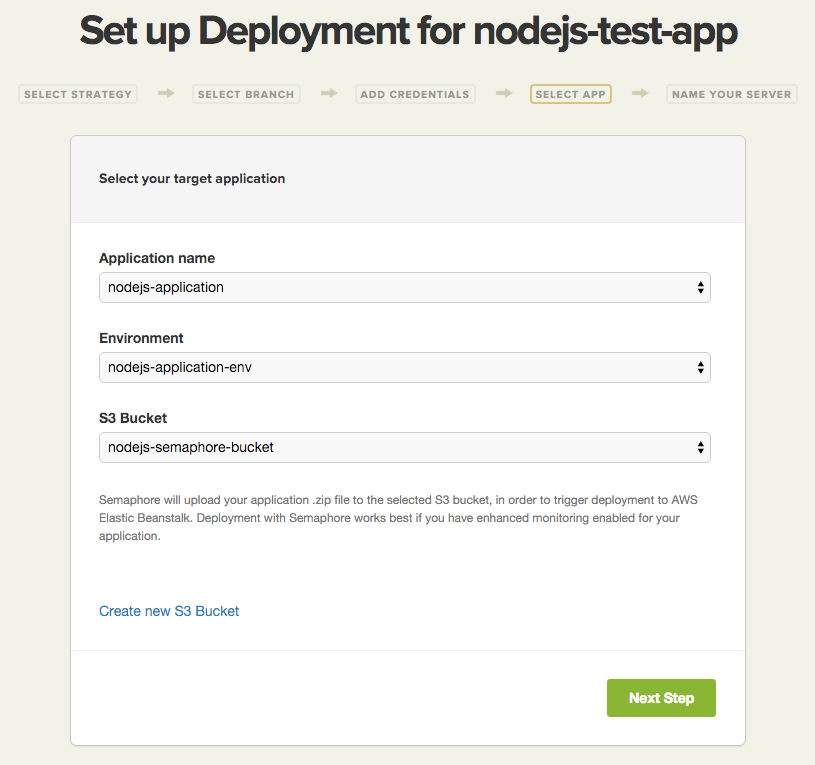

## Naming the Server and Deploying the Application

The next step is to name the server and create it.

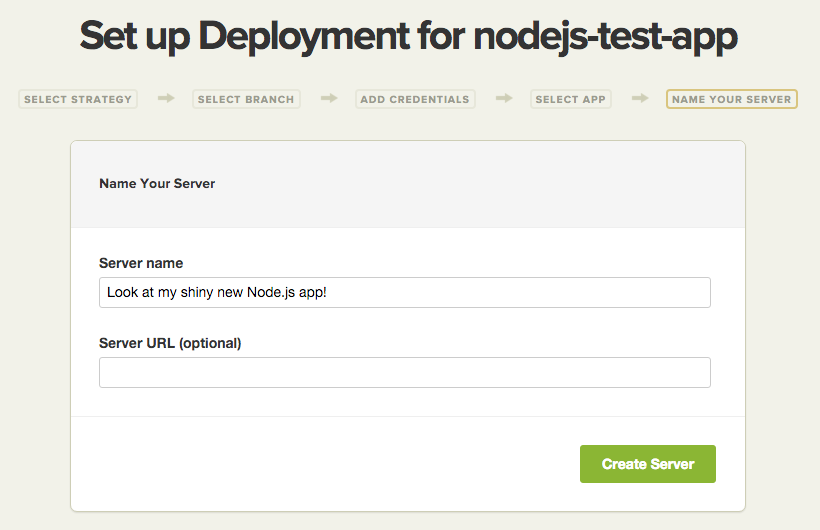

Once you’ve created the server, click on “Deploy” to deploy your application.


Now all that’s left to do is wait for the deploy commands to finish executing.

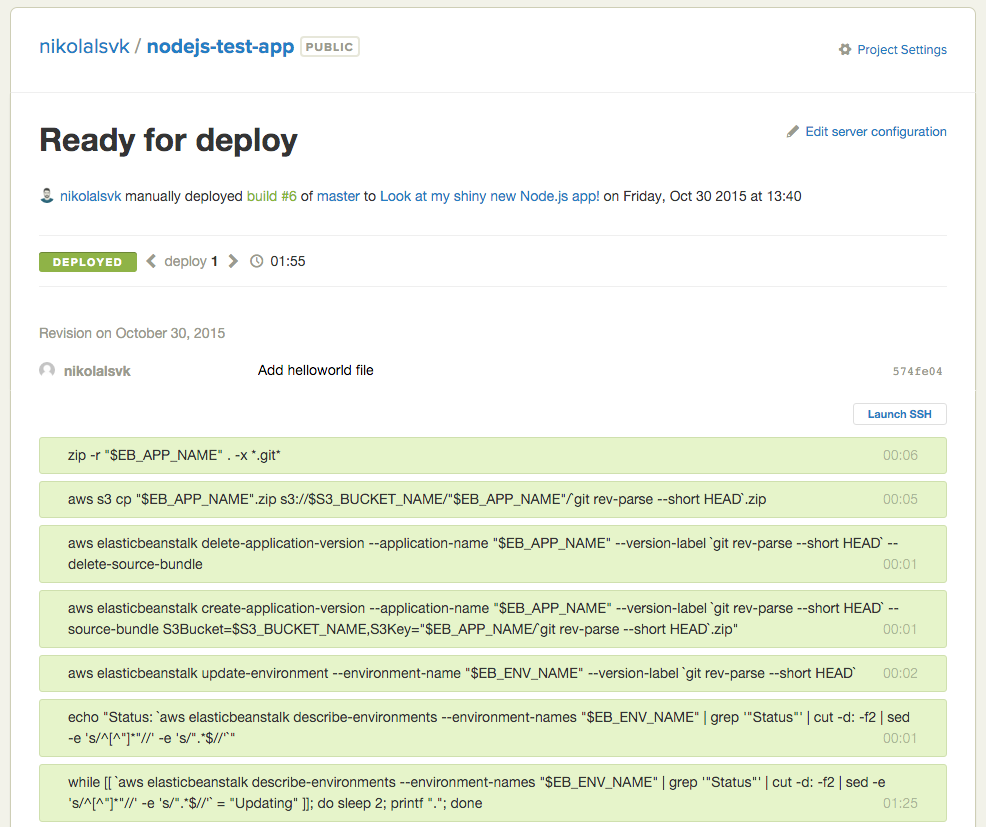

Congratulations! You’ve successfully deployed your Node.js application to AWS Elastic Beanstalk.
