> This blog post was coauthored with my coworker, [Jelena Keravica](https://github.com/jelenicak). Thanks for collaborating back in the day.

### Introduction

With AWS Elastic Beanstalk, you can quickly deploy and manage applications in the AWS cloud without having to worry about the infrastructure that supports those applications. AWS Elastic Beanstalk automatically handles all the details of capacity provisioning, load balancing, scaling, and application health monitoring.

This article will explain how to set up continuous deployment for your Rails application on Elastic Beanstalk using Semaphore. First, we will initialize an environment on Elastic Beanstalk console and add some changes to our Rails application configuration. Then, we can go on to set up deployment on Semaphore.

### Prerequisites

Before you begin, you will need to:

- Create an [AWS account](http://aws.amazon.com/)
- Add your project from GitHub or Bitbucket to Semaphore. Click [here](https://docs.semaphoreci.com/guided-tour/creating-your-first-project/) to learn how.

## Initializing an Elastic Beanstalk Environment

An Elastic Beanstalk application is a logical collection of Elastic Beanstalk components, including environments, versions, and environment configurations. In Elastic Beanstalk, an application is conceptually similar to a folder. An environment is a version that is deployed onto AWS resources. Each environment runs only a single application version at a time.

### Creating an Application

The first step is to create an application on the [Elastic Beanstalk console](https://console.aws.amazon.com/elasticbeanstalk/home?). In the upper right corner, select the region in which to create the Elastic Beanstalk application. You should probably pick the one closest to your location.

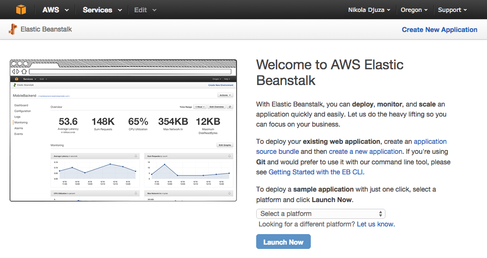

Next, click on “Create New Application”, and choose a name for your Elastic Beanstalk application.


You can also do this from your command line:

```bash
$ aws elasticbeanstalk create-application --application-name rtassignment
```

### Creating the Environment

The next step is to create an environment. You should choose the “Create web server” option.


Your predefined configuration should be set to Ruby and, for now, you can choose “Single instance” as your environment type. You can upgrade to the load-balancing, autoscaling environment when the application is ready for production.

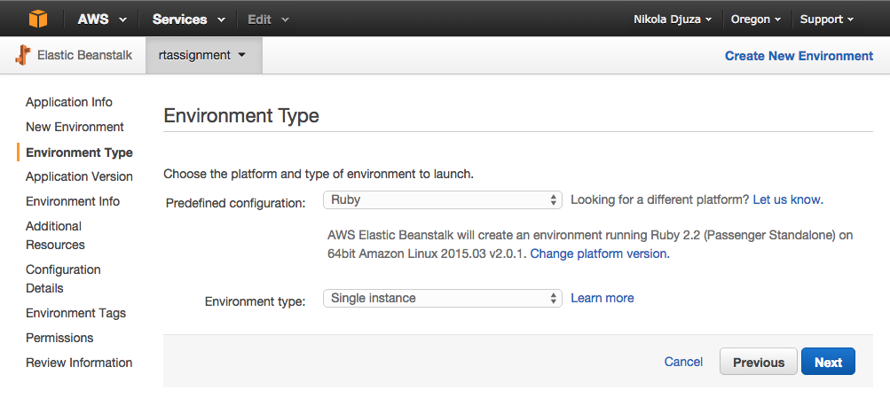

For the initial application version, you can select “Sample application”. This is just a temporary Elastic Beanstalk application which we will use to easily check whether our configuration is correct.

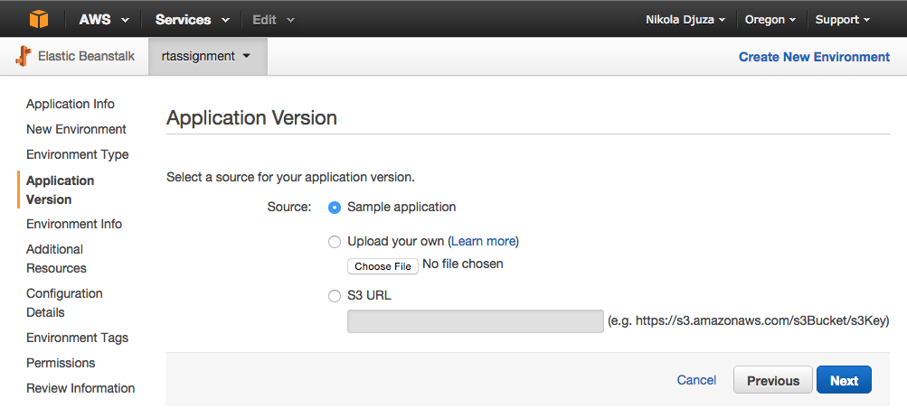

Next, you will need to choose a URL for your application and check its availability.

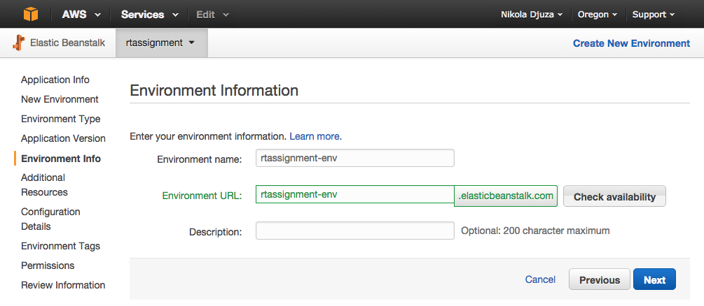

If your application requires a database, you will need to add an RDS DB instance in the following step.

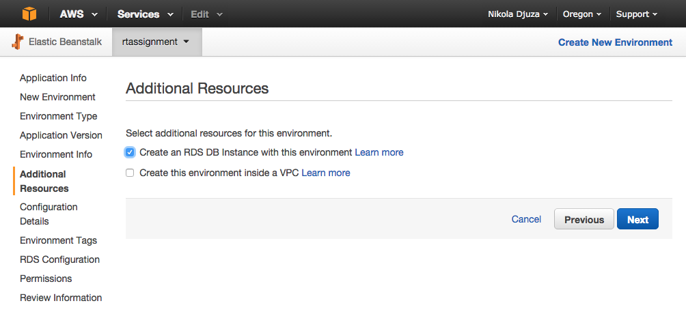

In the next step, you can enter the configuration options as shown in the picture below. Adding the EC2 keypair is optional, but you may need it later for additional configuration, and you can’t add a keypair to a running instance without stopping it.

If you don’t have an EC2 keypair, you can learn how to create one [here](http://docs.aws.amazon.com/AWSEC2/latest/UserGuide/ec2-key-pairs.html#having-ec2-create-your-key-pair), or, if you want to import your own public key created using a third-party tool, you can follow [these instructions](http://docs.aws.amazon.com/AWSEC2/latest/UserGuide/ec2-key-pairs.html#how-to-generate-your-own-key-and-import-it-to-aws).


When you create a new environment, you can specify tags to categorize the environment. Tags can help you identify environments in cost allocation reports, which is especially useful if you have many to manage. These are optional, so you can choose to leave the fields empty.

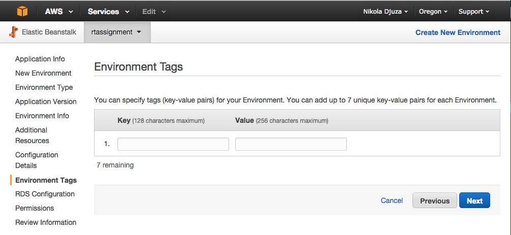

In this example, we are using Postgres as our DB engine, but you can choose your own from the select box.

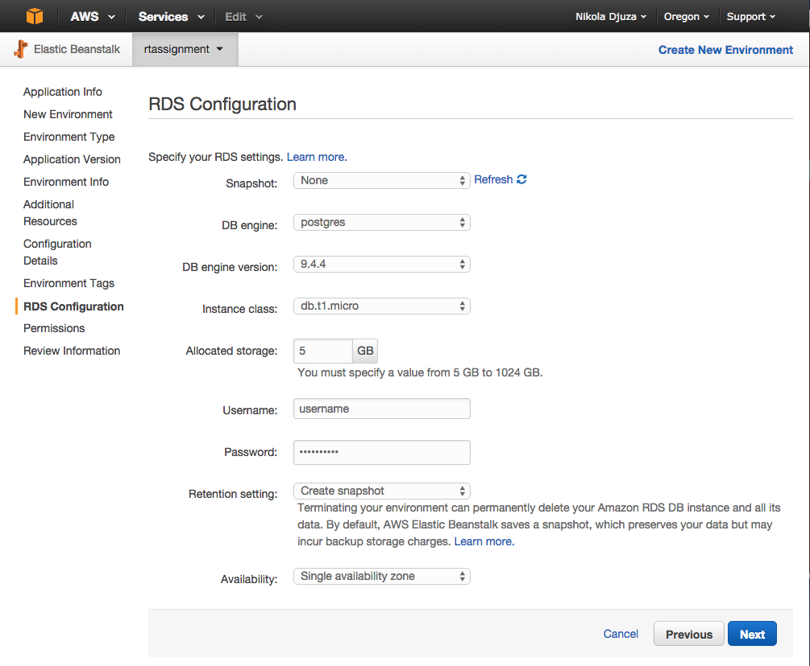

The last step is to define permissions for your environment. When you create a new environment, AWS Elastic Beanstalk prompts you to provide two AWS Identity and Access Management (IAM) roles, a service role and an instance profile.

A role is essentially a set of permissions that grant access to actions and resources in AWS. An instance profile is a container for an IAM role that you can use to pass role information to an EC2 instance when the instance starts. This allows the Elastic Beanstalk service to monitor environment resources on your behalf. You can read more about permissions in the [Elastic Beanstalk documentation](https://docs.aws.amazon.com/elasticbeanstalk/latest/dg/concepts-roles.html).

For most environments, the service role and instance profile that the AWS Management Console prompts you to create with 1-click role creation when you launch your environment include all of the permissions you need. We will use those in the example.

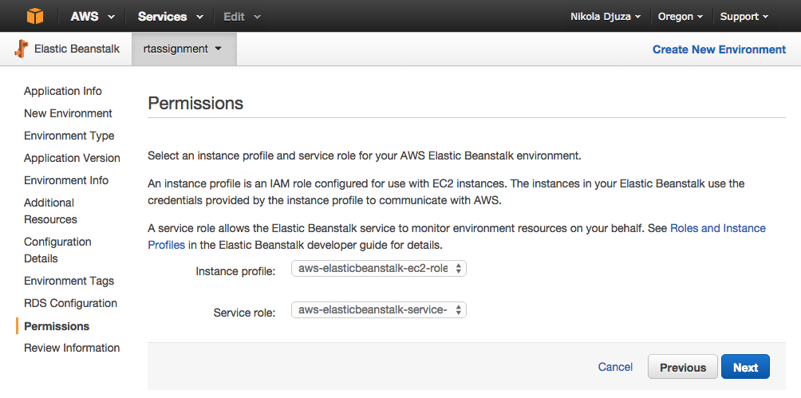

The final step is to review theinformation and, when you’ve confirmed it and clicked “Launch”, the environment should start initializing. It can take a while if you have selected the option to create RDS database.

You can also do this from your command line with the following commands:

```bash
$ aws elasticbeanstalk create-environment --application-name rtassignment --environment-name rtassignment-env --version-label version-1 --solution-stack-name "64bit Amazon Linux 2015.03 v2.0.0 running Ruby 2.2 (Puma)"
```

The solution stack name is basically your server configuration. We are using `"64bit Amazon Linux 2015.03 v2.0.0 running Ruby 2.2 (Puma)"` for the solution stack name, but you can explore other solutions that can be listed using the following command:

```bash
$ aws elasticbeanstalk list-available-solution-stacks
```

When the environment status turns green, you can click the URL on the console. If you see the welcome screen of the sample application, it means that your environment has been properly configured.

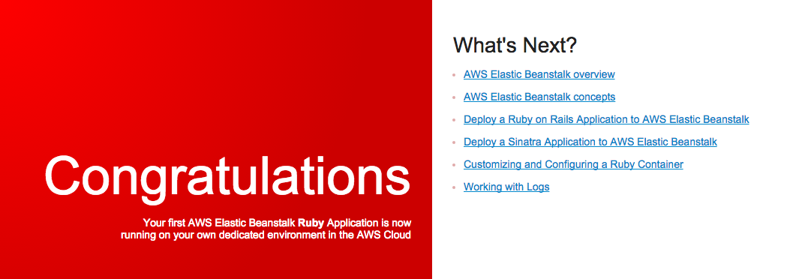

### Retrieving Security Credentials

Before you move on, you will need to retrieve security credentials, which you will use later on to provide Semaphore with access to your application. You can get your credentials by clicking on your name in the upper right corner of Elastic Beanstalk management console and selecting “Security credentials”.

In the left navigation bar, click the “Users” option and create a new user. Choose a name for your user, download the credentials and store them somewhere safe — you will need those to configure Semaphore in one of the following steps.

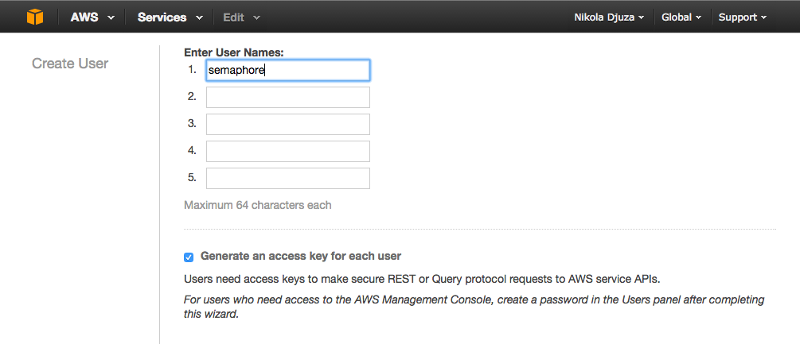

Next, you need to define a set of permissions for the newly created user. These are the permissions you will delegate to Semaphore in order to deploy your application. In the users list, click the username to see its page. AWS uses managed policies to define these permissions, A policy can be attached to a user or a group. If you have many users, groups provide an easy way to manage their permissions. However, if this is the first time you are using Elastic Beanstalk and you just want to try it out, you can attach a policy straight to your user.

By clicking the “Attach Policy” button under “Permissions”, you will see a list of predefined AWS policies. If you choose the `AWSElasticBeanstalkFullAccess` policy, your deployment will work , but this is usually not recommended. By following the standard security advice of granting least privilege, you should grant only the permissions required to perform a task.

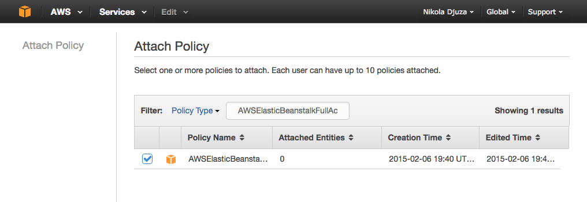

## Preparing Your Rails Application

The Elastic Beanstalk console allows you to define a set of environment variables for your application. The one you are certainly going to need is `SECRET_KEY_BASE`. This variable is used for specifying a key which allows the sessions used by the application to be verified against a known secure key to prevent tampering. You can get it by typing `bundle exec rake secret` command in your Rails project folder.

Go to your [Elastic Beanstalk console](https://console.aws.amazon.com/elasticbeanstalk/home?), select your application environment and choose “Software configuration” under the “Configuration” option in the left navigation bar. Paste the long string into the appropriate field.

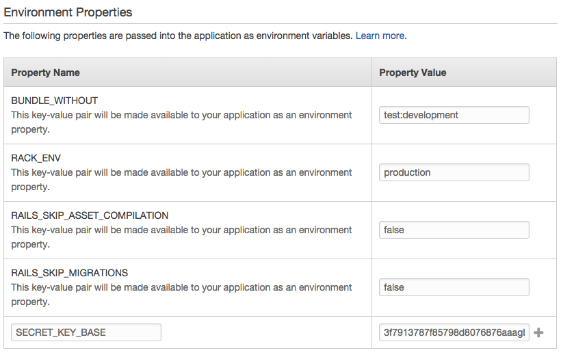

## Deploying Your Rails Application with Semaphore

Now that you have initialized your environment and configured your Rails application, it’s time to finally deploy it. Go to the [Semaphore home page](https://semaphoreci.com/), find your project and add a new deployment server. On the next page, choose Elastic Beanstalk.


### Choosing the Deployment Strategy

For the purpose of this tutorial, we will use the Automatic deployment strategy. This means that every successful build on the branch you choose will launch a deploy.

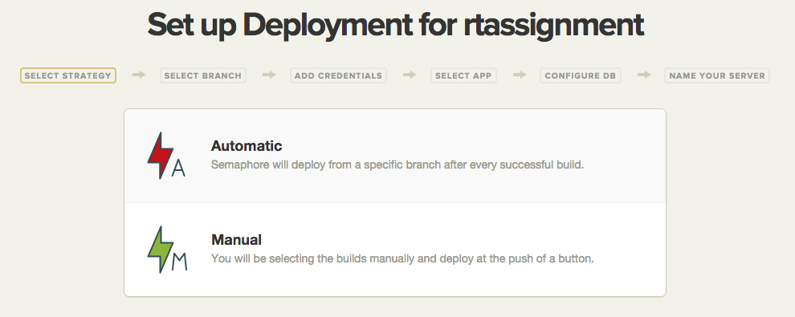

In the next step, you will need to choose the branch you wish to deploy.

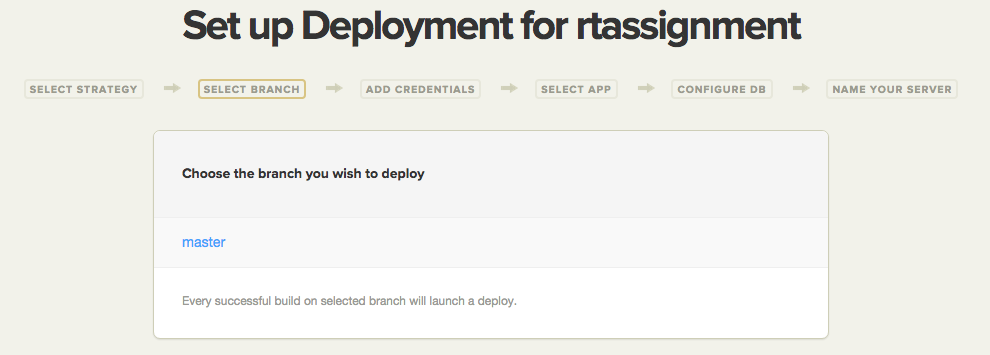

### Entering the AWS Credentials

Enter the AWS credentials you retrieved in the “Security Credentials” step of this tutorial, and select the region your application resides in. This will enable Semaphore to list the application and environments you have in the region you specified.


### Selecting the Application and the Environment

Next, you will need to select your target application and environment. In this example, we see that Semaphore found the my-app application and its environment. Also, you will need to select the S3 bucket where your project .zip file will be uploaded, because this is where Elastic Beanstalk will look for your application files.

In this tutorial, we are assuming that you are using the default Elastic Beanstalk deployment process. However, the same setup on Semaphore will also work if you are using Elastic Beanstalk with Docker in a [single container environment](http://docs.aws.amazon.com/elasticbeanstalk/latest/dg/docker-singlecontainer-deploy.html).

When you created the Elastic Beanstalk application in the previous steps, a bucket named something similar to `elasticbeanstalk-us-west-2-057267302678` should have been created. It’s fine if you want to select some other bucket with a more descriptive name.

You can create a new S3 bucket on the next form by clicking the “Create new S3 Bucket” link and entering the bucket name. Alternatively, you can go to the [S3 Management Console](https://console.aws.amazon.com/s3) and create one there, in which case you just need to hit refresh on the Semaphore page.


### Configuring the Database

Elastic Beanstalk uses a custom `database.yml` file, and Semaphore will generate one for you.

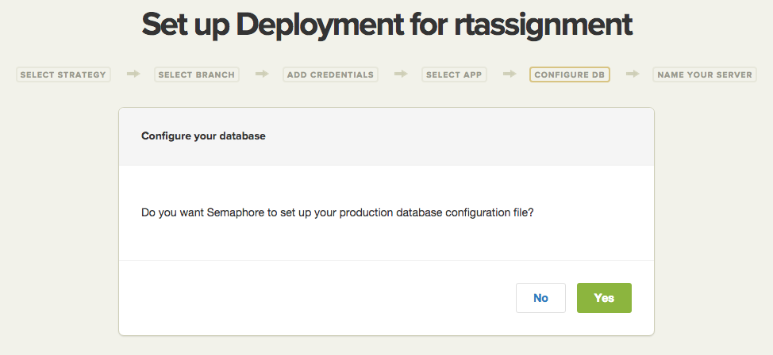

Next, you just need to select your database adapter and enter the name of your database environment (e.g. “production”).
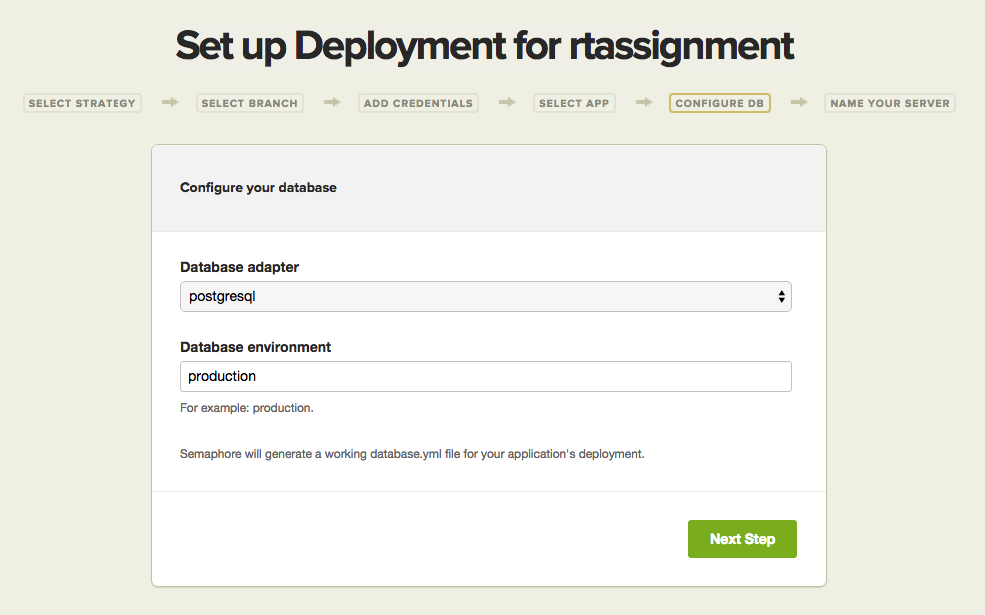

We will select Postgres, just like we did when we created the application on the Elastic Beanstalk console. Your database environment name should match the `RACK_ENV` environment variable, which we mentioned in the segment titled “Preparing Your Rails Application” .

### Naming Your Server

Now that you’ve configured the database, you can name your server and create it.


### Deploying the Application

Click on “Deploy” to deploy your application.

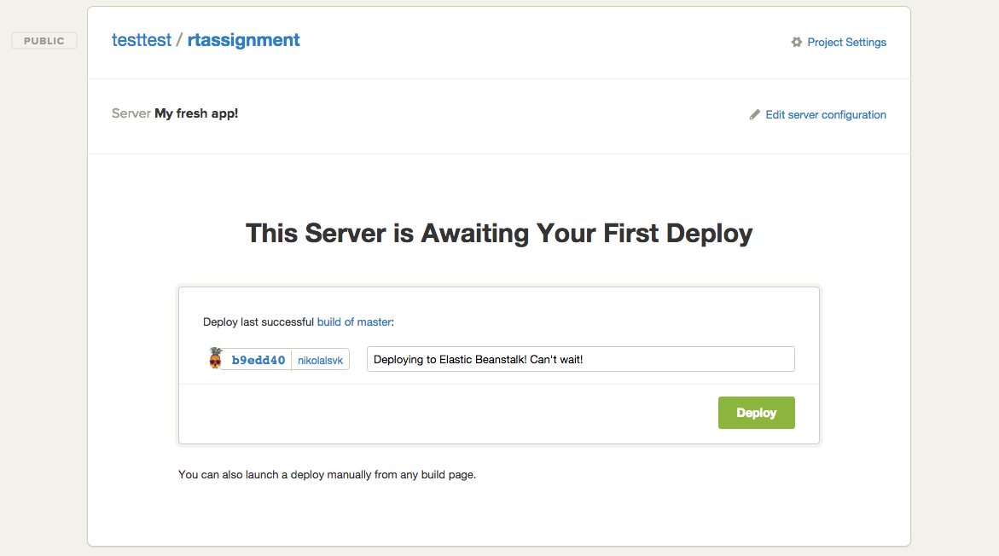

Now, you just need to wait for the deploy commands to finish executing.


Congratulations! You’ve successfully deployed your application to AWS Elastic Beanstalk.
