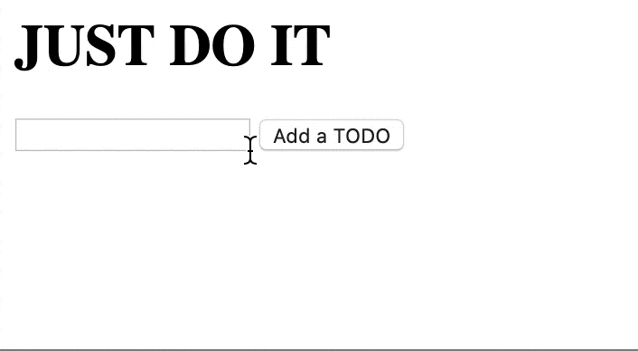

<div class="photo-caption">
Photo from <a href="https://blog.appsignal.com/2020/05/14/javascript-growing-pains-from-0-to-13000-dependencies.html
">AppSignal's Blog</a>
</div>

In today’s post, we’re going to demystify how the number of JavaScript dependencies grows while we’re working on a relatively simple project. Should you be worried about the number of dependencies?

Keep in mind that this blog post is related to the [Ride Down The JavaScript Dependency Hell](https://blog.appsignal.com/2020/04/09/ride-down-the-javascript-dependency-hell.html) blog post that was released a while back. We’ll show a “real-world” example of how a project’s dependencies can grow from zero to 13K.

Having a large number of dependencies in a project isn’t necessarily a bad thing, but we’ll get to that later. First, let’s see how a project can grow from a couple of dependencies to a large number.

## Building a TODO in HTML and JavaScript

To best illustrate the growing pains, we are going to create a simple application that keeps track of things we need [to do](https://www.youtube.com/watch?v=ZXsQAXx_ao0). This is how it’s going to look like:


Pretty simple at this point—we don’t want to get wild and fancy at this moment. You can take a look at the code on [just-do-it GitHub repo](https://github.com/nikolalsvk/just-do-it/tree/4f72c2a23750e4fa229bdd878a6c2cd66e382f07).

Right now, the only dependency this app needs is a browser that can open HTML pages. We can accomplish this with pretty much every browser out there.

Let’s see where we are with the number of dependencies at this point. We will create a table with four columns:

- direct dependencies — the number of dependencies we installed (together with `devDependencies`)
- inherited dependencies — the number of dependencies that installed with direct dependencies
- total — the total number of the above two
- new dependencies — how many dependencies got installed in the previous installation

| Direct dependencies | Inherited dependencies | Total                    | New dependencies |
| ------------------- | ---------------------- | ------------------------ | ---------------- |
| 0                   | 0                      | 0 (not counting browser) | 0                |

The project still doesn’t have a `package.json`, so we are still not part of that sweet NPM package ecosystem. This is useful if you don’t want to complicate things. But right now, we are not here for simple solutions. We want to simulate how you can go from zero to a bunch of dependencies fast!

So, as any project with front-end out there, we don’t want plain JS. We want to be cool and use React!

## Adding React to Our Project

The React craze is in full swing right now. It may not even reach its peak in 2020. Now is the perfect time to ditch that old plain (Vanilla) JavaScript we’ve been using in our project and switch to what the cool kids are using these days—the almighty React.

We are going to follow the [‘Add React to a Website’](https://reactjs.org/docs/add-react-to-a-website.html) instructions from the official React website. What this means is that we’ll add a script tag element in our HTML:

```html
<head>
  <!-- ... other HTML ... -->
  <script
    src="https://unpkg.com/react@16/umd/react.development.js"
    crossorigin\
  ></script>
  <script
    src="https://unpkg.com/react-dom@16/umd/react-dom.development.js"
    crossorigin\
  ></script>
  <!-- ... other HTML ... -->
</head>
```

But, since we want to use [JSX](https://reactjs.org/docs/introducing-jsx.html), we are going to get a taste of NPM’s ecosystem hands-on. To use JSX, we have to install [Babel](https://babeljs.io/). Babel will compile our JSX file to JS so our browser can render it effortlessly.

First, we need `package.json`. We can add it with the following command:

```bash
$ npm init -y
```

The previous command will set up `package.json` and make our project ready for the installation of Babel:

```bash
$ npm install --save-dev babel-cli@7.1.0 babel-preset-react-app@3

...

+ babel-cli@6.26.0
+ babel-preset-react-app@3.1.2
added 305 packages from 128 contributors and audited 3622 packages in 15.904s
```

Wow, so we explicitly installed two packages—`babel-cli` and `babel-preset-react-app`, but these brought in more dependencies of their own. If you’re new to this idea, you might find it strange. I suggest you read the previous blog post on how [JavaScript dependencies work](https://blog.appsignal.com/2020/04/09/ride-down-the-javascript-dependency-hell.html).

Installing these two packages gets us from 0 NPM dependencies up to 2 direct and 3620 inherited dependencies.

| Direct dependencies | Inherited dependencies | Total | New dependencies |
| ------------------- | ---------------------- | ----- | ---------------- |
| 2                   | 3620                   | 3622  | +3622            |

Great, now we can use JSX while running Babel in the background to watch for our changes:

```bash
$ npx babel --watch src --out-dir . --presets react-app/prod
```

[Check out how the repo looks](https://github.com/nikolalsvk/just-do-it/tree/5d690f9d2deb4e02e2302ecd7e0ddf8da915cf22) after the changes.

Babel will pre-process our JSX files into JS files. But this sounds a bit sketchy. I don’t want to have React load in a script tag. I want a full developer experience, similar to [create-react-app](https://github.com/facebook/create-react-app).

For this, we’ll have to add a bit more of Babel and a bundler—Webpack.

## Adding a Create-React-App-like Setup

To get this right, we will follow the recommended way of [setting up React in a project from scratch](https://blog.usejournal.com/creating-a-react-app-from-scratch-f3c693b84658).

Let’s remove the old Babel dependencies that we used:

```
$ npm uninstall babel-cli babel-preset-react-app --save-dev
```

Nice, we’re back to zero NPM dependencies.

Next, let’s add newer versions of Babel dependencies:

```bash
$ npm install --save-dev @babel/core @babel/cli @babel/preset-env @babel/preset-react

...

+ @babel/cli@7.8.4
+ @babel/preset-react@7.9.4
+ @babel/core@7.9.6
+ @babel/preset-env@7.9.6
added 25 packages from 4 contributors, removed 4 packages, updated 7 packages and audited 4216 packages in 13.394s
```

`babel-core` is the main Babel package—it is needed for Babel to do transformations on our code. `babel-cli` allows you to compile files from the command line. `preset-react` and `preset-env` are both presets that transform specific flavors of code—in this case, the env preset allows us to transform ES6+ into more traditional JS and the React preset does the same, but with JSX instead.

Now that we got that out of the way, we have a total of 4216 dependencies based on the npm audit report.

Now, our table of dependencies looks like this:

| Direct dependencies | Inherited dependencies | Total | New dependencies |
| ------------------- | ---------------------- | ----- | ---------------- |
| 4                   | 4212                   | 4216  | +594             |

After this, we need Webpack to bundle everything for us nicely. Also, we will set up a server that will watch for any changes we make to our app in development.

We can install the necessary dependencies with:

```bash
$ npm install --save-dev webpack webpack-cli webpack-dev-server style-loader css-loader babel-loader

...

+ css-loader@3.5.3
+ babel-loader@8.1.0
+ style-loader@1.2.1
+ webpack-cli@3.3.11
+ webpack-dev-server@3.10.3
+ webpack@4.43.0
added 448 packages from 308 contributors and audited 13484 packages in 23.105s
```

This added some more packages. Now we’re at a total of 13484.

| Direct dependencies | Inherited dependencies | Total | New dependencies |
| ------------------- | ---------------------- | ----- | ---------------- |
| 10                  | 13474                  | 13484 | +9268            |

Well, that escalated quickly! What happened here is that each dependency that we installed has dependencies of its own. Then those dependencies have their dependencies. In the total number (13484), all dependencies plus dependencies of dependencies get included. Even devDependencies! That is why we got an extra 9268 dependencies by installing webpack and other needed dependencies to make it work.

The total number might seem scary and make you wonder what is going on, but this is how the NPM ecosystem works, heck, this is how a lot of package managers work. Most of the dependencies are one-liners and should not be something to worry us. Sometimes, they might be, but we will get to that later.

For example, if we run `npm audit` at this point, we will get this:

```bash
$ npm audit

                       === npm audit security report ===

┌──────────────────────────────────────────────────────────────────────────────┐
│                                Manual Review                                 │
│            Some vulnerabilities require your attention to resolve            │
│                                                                              │
│         Visit https://go.npm.me/audit-guide for additional guidance          │
└──────────────────────────────────────────────────────────────────────────────┘
┌───────────────┬──────────────────────────────────────────────────────────────┐
│ Low           │ Prototype Pollution                                          │
├───────────────┼──────────────────────────────────────────────────────────────┤
│ Package       │ yargs-parser                                                 │
├───────────────┼──────────────────────────────────────────────────────────────┤
│ Patched in    │ >=13.1.2 <14.0.0 || >=15.0.1 <16.0.0 || >=18.1.2             │
├───────────────┼──────────────────────────────────────────────────────────────┤
│ Dependency of │ webpack-dev-server [dev]                                     │
├───────────────┼──────────────────────────────────────────────────────────────┤
│ Path          │ webpack-dev-server > yargs > yargs-parser                    │
├───────────────┼──────────────────────────────────────────────────────────────┤
│ More info     │ https://npmjs.com/advisories/1500                            │
└───────────────┴──────────────────────────────────────────────────────────────┘
found 1 low severity vulnerability in 13484 scanned packages
  1 vulnerability requires manual review. See the full report for details.
```

We see that a dependency of a `webpack-dev-server` has a `yargs-parser` that has a low severity. It’s a development dependency of `webpack-dev-server` and it probably should not worry us. Being a development dependency means that `webpack-dev-server` uses this `yargs-parser` in development, and it is very unlikely that this code will end up in our production bundle.

Remember, so far we’ve only added devDependencies. All of these are not going to end up in our production bundle, so nothing to worry about, right? Let’s continue and find out.

We now need to add React, since we don’t want to have script tags in the header to fetch it.

## Adding React

Let’s move React from the head straight into `package.json`:

```bash
$ npm install react react-dom

...

+ react@16.13.1
+ react-dom@16.13.1
added 5 packages and audited 13506 packages in 6.148s
```

| Direct dependencies | Inherited dependencies | Total | New dependencies |
| ------------------- | ---------------------- | ----- | ---------------- |
| 12                  | 13494                  | 13506 | +22              |

Now, this is different. We only got 22 extra dependencies from installing `react` and `react-dom`. If we run npm audit for production, we’ll get this:

```bash
npm audit --production

                       === npm audit security report ===

found 0 vulnerabilities
 in 22 scanned packages
```

The audit output means that a total of 22 packages will end up in our production bundle—the code that we will serve to folks visiting our TODO list application. That doesn’t sound so bad compared to the staggering total of 13506 dependencies we have in our development environment.

After we installed all of these dependencies and reworked our code to use Webpack and Babel, our application is still working:



BTW, you can view all the code we added in the [repo on GitHub](https://github.com/nikolalsvk/just-do-it). We did not go into details of how we created React components and set up Webpack. We focused more on the dependencies and what their numbers mean. If you’re interested in technical details of how the TODO list is working, please visit the repo mentioned above.

## Should You Be Worried About So Many Dependencies?

Yes and no. There’s always risk out there. Let’s go through 2 recent cases of dependency problems that the community encountered.

### Slipping Malicious Code Into a Library

A while ago, there was a situation with a [widely used NPM package—event-stream](https://github.com/dominictarr/event-stream). Someone injected malicious code into the popular package aiming to get cryptocurrency information from its users. The package did not get hacked. Just the opposite, the attacker was a maintainer that had write access given by the package’s creator. If you’re interested in the conversation, check out the [GitHub issue about it](https://github.com/dominictarr/event-stream/issues/116). There is also the [NPM blog post](https://blog.npmjs.org/post/180565383195/details-about-the-event-stream-incident) about it.

The good thing is that this hack got identified and stopped before it reached the users. The bad thing is that this was an official release of the package.

### Breaking Everyone’s Build Process

More recently, [another massively used `is-promise`](https://github.com/then/is-promise) package broke the whole JS ecosystem. The package itself consists of 2 lines of source code. It serves to check whether a JS object is a [Promise](https://developer.mozilla.org/en-US/docs/Web/JavaScript/Reference/Global_Objects/Promise). The library is used by 3.4 million projects, based on GitHub’s reports. Yes, you read that right—three point four million projects.

The recent 2.2.0 update broke everyone’s build process because the project didn’t adhere to ES module standards. Stuff like that happens. It’s not the first time it happened, and it surely will not be the last. If you want to read more about this, there’s a [post mortem about it](https://medium.com/javascript-in-plain-english/is-promise-post-mortem-cab807f18dcc).

### “Trust, but Verify” What You Install

You should know what you’re putting inside your project. You should adopt the “trust, but verify” mentality. There’s no guarantee that situations that happened to `event-stream` or `is-promise` won’t happen in the future to some other dependency. You should not get discouraged from using or contributing to open-source projects, though. This incident got discovered because of just that—group effort. Just be mindful of what you put inside of `package.json` so you can act properly when tough times come.

On the other hand, you can’t be aware of every single dependency. Imagine knowing what happens with all the 13k dependencies that we installed—you would probably go insane. Luckily, there are tools out there like [GitHub security alerts](https://help.github.com/en/github/managing-security-vulnerabilities/about-security-alerts-for-vulnerable-dependencies) and GitHub’s whole security initiative.

In the end, there’s not much you can do except be aware of what you add to your project. Make sure to:

- always upgrade packages with care and look into what they are using/adding
- try to avoid nested dependencies when possible
- pin a package to a specific version and do not auto-update

I hope this blog post added even more insight into what is going on when you add dependencies to your JavaScript project. I also hope it raised some awareness for open-source security and that it will make you more careful when running that `npm install` command.

There is an interesting [HackerNews discussion](https://news.ycombinator.com/item?id=23517595) as well.
