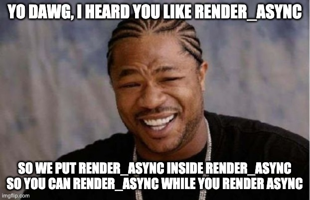
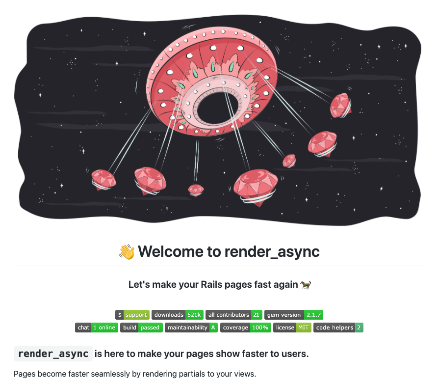

In this blog post, we will explain all new features and how they came to be in the
latest [2.1.7 version](https://github.com/renderedtext/render_async/releases/tag/2.1.7).


<div class="photo-caption">
<span>Photo by <a href="https://unsplash.com/@asaelamaury?utm_source=unsplash&amp;utm_medium=referral&amp;utm_content=creditCopyText">Asael Peña</a> on <a href="https://unsplash.com/s/photos/wait?utm_source=unsplash&amp;utm_medium=referral&amp;utm_content=creditCopyText">Unsplash</a></span>
</div>

Hey, thanks for reading about the new release, I truly appreciate it! Before we jump
into details, I'd like to mention that there is not a [render_async Discord server](https://discord.gg/SPfbeRm).
Please join us there, we are just starting! Let's make this gem even better.

The new version has a couple of new features you can try out:

- Retry render_async request after some time
- Control polling by dispatching events
- Customize content_for name

Also, our README got a brand new shine to it ✨

Let's go over all the new features and how to use them.

## Wait a bit, then retry

Before, we added a feature where you could tell render_async to retry the
request if it fails. It is pretty straightforward. All you need to do is
specify the number of retries you want to have. If the request is not
successful after, let’s say, three attempts, the render_async will stop
retrying.

Retrying is useful for some endpoints that are 'flaky', meaning that sometimes they
return the successful response, sometimes they fail. To do this, you can write the following:

```erb
<%= render_async users_path, retry_count: 5 %>
```

By setting `retry_count`, we are telling how many times render_async should
retry the request to the `users_path` in our case. But, for some folks, it may be
useful to have some delay between the requests. For example, maybe the server
you are trying to reach is overcrowded, and it could use a break from constant
requests. Whatever the reason is, you can now set a `retry_delay` like so:

```erb
<%= render_async users_path,
                 retry_count: 5,
                 retry_delay: 2000 %>
```

We are giving the server a 2 seconds break before render_async makes another
request to it. The logic with retrying will stay the same, meaning the
render_async will quit retrying after 5th attempt.

I'm happy to hear your experiences with this feature! Consider joining
the [render_async Discord server](https://discord.gg/SPfbeRm) and get a response quickly!

## Hey, you, stop. OK, now start.

With `render_async`, you can easily do
[HTML polling without having to write JavaScript](/rails-html-polling-without-writing-javascript).
You can do this by writing this in your view:

```erb
<%= render_async comments_path, interval: 5000 %>
```

render_async will then send a request to `comments_path` every 5 seconds. This
is all nice and dandy, but how in the hell do you stop it? I am glad you asked.
Before, you could control polling by interacting with an element on the page,
such as a link that can stop and start polling. To do this, you can do
something like so:

```erb
<a href='#' id='comments-button'>Load comments</a>

<%= render_async comments_path,
                 toggle: { selector: '#comments-button', event: :click },
                 interval: 2000 %>
```

The "Load comments" button will serve as a switch, toggle if you like. What you need to do
is to specify what is a toggle to render_async. You can do this by passing a toggle options
object with `selector` - an ID of the element, and `event` - e.g. 'click' if the element is a button.

In our case, whenever a user clicks the "Load comments" button, the polling
will stop if started, or start if stopped.
You could utilize [events render_async is dispatching](https://github.com/renderedtext/render_async#passing-in-an-event-name)
after each request to change the copy of the link
if you want, but that's a story for another post.
Consider joining [the newsletter](/newsletter) to get new posts ASAP.

### Stop, but with events

We described one way on how to control polling. The new version added the ability to
control polling by dispatching events. In other words, render_async now listens for:

- 'async-stop', and
- 'async-start' events.

All you need to do is the following:

```erb
<%= render_async comments_path,
                 container_id: 'controllable-interval', # set container_id so we can get it later easily
                 interval: 3000 %>
```

render_async will poll the `comments_path` every 3 seconds, and it will put the response in the
container with `controlalble-interval` ID. We will see in a second why this matters. Then,
in your view, you can put two buttons - one to stop polling, another to start it.

```markup
<button id='stop-polling'>Stop polling</button>
<button id='start-polling'>Start polling</button>

<script>
  var container = document.getElementById('controllable-interval')
  var stopPolling = document.getElementById('stop-polling')
  var startPolling = document.getElementById('start-polling')

  var triggerEventOnContainer = function(eventName) {
    var event = new Event(eventName);

    container.dispatchEvent(event)
  }

  stopPolling.addEventListener('click', function() {
    container.innerHTML = '<p>Polling stopped</p>'
    triggerEventOnContainer('async-stop')
  })
  startPolling.addEventListener('click', function() {
    triggerEventOnContainer('async-start')
  })
</script>
```

We then trigger 'async-stop' whenever "Stop polling" is clicked, or we trigger
'async-start' whenever "Start polling is clicked.

> 💡 Please note that events need to be dispatched to a render_async container.

Controlling through events is pretty neat if you need that fine-grained control
over the polling. Another improvement
that can be made is to [stop polling based on the response from a server](https://github.com/renderedtext/render_async/issues/106)
or to pass in an option to
[start polling immediately when the toggle is set](https://github.com/renderedtext/render_async/issues/118)
(which is not the case right now). If you are interested in any of these or have questions or feedback,
consider joining the [render_async Discord server](https://discord.gg/SPfbeRm)!

## Naming is hard

Another feature in the 2.1.7 version allows you to specify a name for the
`content_for` where render_async code will reside. It might not make much
sense to you at first, but there is a possibility to have a render_async inside
render_async 🤯.



You would call render_async for one endpoint, and that endpoint has another render_async call
in its response. You can get into more details in [the README](https://github.com/renderedtext/render_async#nested-async-renders).
The new version allows you to differentiate the place where the logic for the
nested render_async will reside.

```
<%= render_async comment_stats_path, content_for_name: :render_async_comment_stats %>

<%= content_for :render_async_comment_stats %>
```

The nested render_async's logic will render in a different place than the one
from the parent render_async call. In the example above, the content will
render inside `render_async_comment_stats` path, considering you put the
`content_for` with that name.

Anyways, if doing this cascade rendering is your thing, we have a bug that we
need some help with. The problem that happens is that [JavaScript doesn't get evaluated](https://github.com/renderedtext/render_async/issues/30)
if you use the Vanilla JS version of the gem. The jQuery version works
perfectly fine because the `replaceWith` method from jQuery evaluates JS that
you give to it. If you have any ideas on how to solve this in plain JavaScript, join
[our Discord](https://discord.gg/SPfbeRm), and let's talk there.

## New look, who this?

Furthermore, render_async got its README page polished a bit! Check it out [here](https://github.com/renderedtext/render_async)
if you'd like, or admire the photo below:



Do not forget to star 🌟 the project and share it with your friends and
coworkers if you find it useful.

## Final thoughts

Releasing a new version, polishing the README, and working on new features was
a blast! Thanks for everyone that helped and keep doing the great work on
contributing. I know I
mentioned this a few times in the post, but please join the
[Discord](https://discord.gg/SPfbeRm) if you are using this gem, that way we
can make it even better!

P.S. 💸 If you like my work on this gem so far, and you want to give me some juice
and motivation to keep improving and maintaining it, consider sponsoring me on
[GitHub Sponsors](https://github.com/sponsors/nikolalsvk) or through
[PayPal](https://www.paypal.me/nikolalsvk/9.99).

Also, feel free to share this on Twitter with friends and coworkers below:

Until the next one, cheers!
