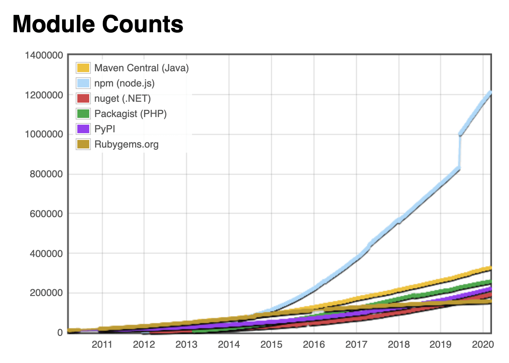
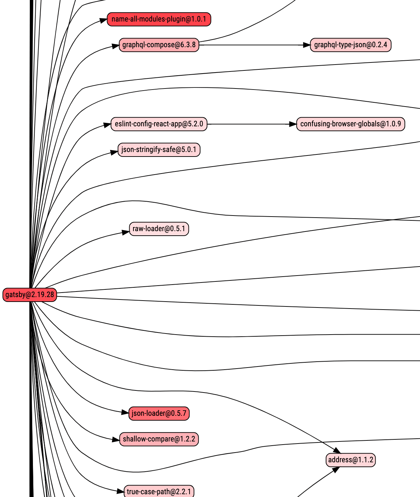
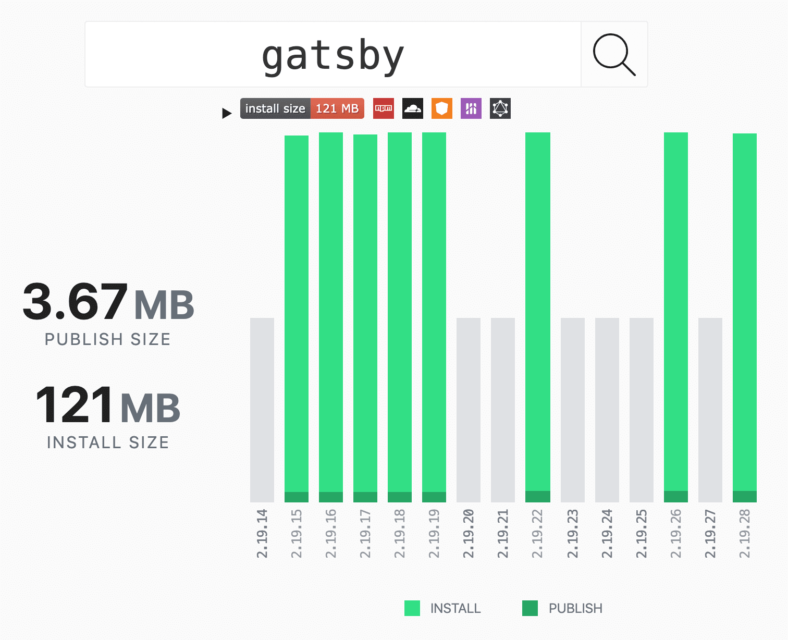

<div class="photo-caption">
Photo from <a href="https://blog.appsignal.com/2020/04/09/ride-down-the-javascript-dependency-hell.html">AppSignal's Blog</a>
</div>

Every JavaScript project starts ambitiously, trying not to use too many NPM
packages along the way. Even with a lot of effort on our side, packages
eventually start piling up. `package.json` gets more lines over time, and
`package-lock.json` makes pull requests look scary with the number of additions
or deletions when dependencies are added.

“This is fine” — the team lead says, as other team members nod in agreement.
What else are you supposed to do? We are lucky that the JavaScript ecosystem is
alive and thriving! We should not be reinventing the wheel every time and
trying to solve something that the open-source community has already solved.

Let’s say you want to build a blog and you would like to use Gatsby.js. Try
installing it and saving it to your dependencies. Congratulations, you just
added 19000 extra dependencies with it. Is this behavior okay? How complex can
the JavaScript dependency tree become? How does it turn into a dependency hell?
Let’s dive into the details and find out.

## What is a JavaScript Package?

NPM—the Node Package Manager, holds the biggest registry of JavaScript packages
in the world! It’s bigger than RubyGems, PyPi, and Maven combined! This is
according to the [Module Counts website](http://www.modulecounts.com/) which
tracks the number of packages inside the most popular package registries.



That’s a lot of code, you must be thinking. And it is. To have your piece of
code become an NPM package, you need a `package.json` in your project. This
way, it becomes a package that you can push to the NPM registry.

## What is package.json?

By definition, package.json:

- Lists the packages your project depends on (lists dependencies)
- Specifies versions of a package that your project can use using semantic versioning rules
- Makes your build reproducible, and therefore, easier to share with other developers.

Envision this as a README on steroids. You can define your package dependencies
there, write build and test scripts, as well as version your package the way
you want and describe it and what it does. We are mostly interested in the
ability to specify dependencies inside the `package.json`.

This already sounds a bit chaotic. Imagine having a package that’s dependant on
another package, that’s dependant on another. Yeah, it can go on like that as
much as you like. This is the reason why you get 19k extra dependencies when
you install a single package—Gatsby.

## Types of Dependencies in package.json

To better understand how dependencies accumulate over time, we’ll go through
different types of dependencies a project can have. There are several
dependencies you can encounter inside package.json:

- `dependencies` — these are the essential dependencies that you rely on and call in your project’s code
- `devDependencies` — these are your development dependencies, for example, a [prettier](https://prettier.io/) library for formatting code
- `peerDependencies` — if you set a peer dependency in your package.json, you are telling the person who installs your package that they need that dependency with the specified version
- `optionalDependencies` — these dependencies are optional and failing to install them will not break the installation process
- `bundledDependencies` — it’s an array of packages that will come bundled with your package. This is useful when some 3rd party library is not on NPM, or you want to include some of your projects as modules

## The Purpose of package-lock.json

We all know that file that always gets lots of additions and deletions in pull
requests and we often take it for granted. `package-lock.json` is automatically
generated each time the package.json file or node_modules directory changes.
It keeps the exact dependency tree that was generated by the install so that
any subsequent installs can generate the identical tree. This solves the
problem of me having another version of the dependency, and you have another.

Let’s take a project that has React in its dependencies in `package.json`. If
you go to the `package-lock.json` you will see something like this:

```json
    "react": {
      "version": "16.13.0",
      "resolved": "https://registry.npmjs.org/react/-/react-16.13.0.tgz",
      "integrity": "sha512-TSavZz2iSLkq5/oiE7gnFzmURKZMltmi193rm5HEoUDAXpzT9Kzw6oNZnGoai/4+fUnm7FqS5dwgUL34TujcWQ==",
      "requires": {
        "loose-envify": "^1.1.0",
        "object-assign": "^4.1.1",
        "prop-types": "^15.6.2"
      }
    }
```

`package-lock.json` is a large list of dependencies in your project. It lists
their version, location of the module (URI), a hash that represents the
integrity of the module and the packages it requires. If you read on, you can
find each entry for every package React requires, and so on. This is where the
actual dependency hell lives. It defines everything that your project needs.

## Breaking Down Gatsby.js Dependencies

So, how do we end up with 19k dependencies by installing just one? The answer
is: dependencies of dependencies. This is what happens when we try to install
Gatsby.js:

```bash
$ npm install --save gatsby

...

+ gatsby@2.19.28
added 1 package from 1 contributor, removed 9 packages, updated 10 packages and audited 19001 packages in 40.382s
```

If we look at package.json, there’s only one dependency there. But if we peek
into package-lock.json, it’s an almost 14k line monster that just got
generated. A more detailed answer to all this lies in the
[package.json inside the Gatbsy.js GitHub repo](https://github.com/gatsbyjs/gatsby/blob/master/package.json).
There are a lot of direct dependencies—[132 counted by npm](https://www.npmjs.com/package/gatsby).
Imagine one of those dependencies having just one other dependency—you just
doubled the amount to 264 dependencies. Of course, the real world situation is
way different. Each dependency has a lot more than just 1 extra dependency, and
the list goes on.

For example, we can try to see how many libraries require
[`lodash`](https://lodash.com/).

```bash
$ npm ls lodash
example-js-package@1.0.0
└─┬ gatsby@2.19.28
  ├─┬ @babel/core@7.8.6
  │ ├─┬ @babel/generator@7.8.6
  │ │ └── lodash@4.17.15  deduped
  │ ├─┬ @babel/types@7.8.6
  │ │ └── lodash@4.17.15  deduped
  │ └── lodash@4.17.15  deduped
  ├─┬ @babel/traverse@7.8.6
  │ └── lodash@4.17.15  deduped
  ├─┬ @typescript-eslint/parser@2.22.0
  │ └─┬ @typescript-eslint/typescript-estree@2.22.0
  │   └── lodash@4.17.15  deduped
  ├─┬ babel-preset-gatsby@0.2.29
  │ └─┬ @babel/preset-env@7.8.6
  │   ├─┬ @babel/plugin-transform-block-scoping@7.8.3
  │   │ └── lodash@4.17.15  deduped
  │   ├─┬ @babel/plugin-transform-classes@7.8.6
  │   │ └─┬ @babel/helper-define-map@7.8.3
  │   │   └── lodash@4.17.15  deduped
  │   ├─┬ @babel/plugin-transform-modules-amd@7.8.3
  │   │ └─┬ @babel/helper-module-transforms@7.8.6
  │   │   └── lodash@4.17.15  deduped
  │   └─┬ @babel/plugin-transform-sticky-regex@7.8.3
  │     └─┬ @babel/helper-regex@7.8.3
  │       └── lodash@4.17.15  deduped
  ...
```

Luckily, most of them are using the same version of `lodash`, which just needs
one `lodash` to install inside `node_modules`. This is often not the case with
real-world production projects. Sometimes, different packages require different
versions of other packages. That is why there are tons of jokes on how heavy
the `node_modules` directory is. In our case, it’s not that bad:

```bash
$ du -sh node\_modules
200M    node\_modules
```

200 megabytes is not **that** bad. I’ve seen it rise above 700 MB easily. If
you’re interested in which modules are taking up most of the memory, you can
run the following command:

```bash
$ du -sh ./node\_modules/\* | sort -nr | grep '\\dM.\*'
 17M    ./node\_modules/rxjs
8.4M    ./node\_modules/@types
7.4M    ./node\_modules/core-js
6.8M    ./node\_modules/@babel
5.4M    ./node\_modules/gatsby
5.2M    ./node\_modules/eslint
4.8M    ./node\_modules/lodash
3.6M    ./node\_modules/graphql-compose
3.6M    ./node\_modules/@typescript-eslint
3.5M    ./node\_modules/webpack
3.4M    ./node\_modules/moment
3.3M    ./node\_modules/webpack-dev-server
3.2M    ./node\_modules/caniuse-lite
3.1M    ./node\_modules/graphql
...
```

Ah, [rxjs](https://github.com/ReactiveX/rxjs), you are a sneaky one. One easy
command that could help you with the size of `node_modules` and flattening
those dependencies is `npm dedup`:

```bash
$ npm dedup
moved 1 package and audited 18701 packages in 4.622s

51 packages are looking for funding
  run \`npm fund\` for details

found 0 vulnerabilities
```

[Deduplication](https://docs.npmjs.com/cli/dedupe) action will try to simplify
the structure of the dependency tree by looking for common packages between
dependencies and moving them around so that they get reused. This is the case
with our example with `lodash` above. A lot of packages settle on
`lodash@4.17.15` so there are no other versions of `lodash` that had to be
installed. Of course, we got this from the start because we just installed our
dependencies, but if you have been adding dependencies to `package.json` for a
while, consider running `npm dedup`. If you’re using `yarn`, you can do
[`yarn dedupe`](https://classic.yarnpkg.com/en/docs/cli/dedupe/), but there’s no need
since this process runs when you `yarn install` so you’re good to go.

## Visualisation of Dependencies

If you’re ever interested in how your project dependencies look like, there are
a couple of tools you can use. Some of the ones I’ve used show your, or any
other, project dependencies in a different manner.

### [npm.anvaka.com](https://npm.anvaka.com/)


Here you can see how each package interconnects, and it all looks like a giant
web. This almost broke my browser since Gatsby.js has so many dependencies.
[Click here](https://npm.anvaka.com/#/view/2d/gatsby) to see how Gatsby.js
dependencies connect. It can also show it in 3D.

### [npm.broofa.com](http://npm.broofa.com/)



This is a view of dependencies similar to a flow chart. It gets complicated for
Gatsby.js pretty fast if you want to [take a look](http://npm.broofa.com/?q=gatsby).
You can mark each dependency’s [npms.io](https://npms.io/) score and it
will color them differently based on their score. You can also upload your
package.json and have it visualized there.

### Package Phobia



A great tool if you want to check how much space a package will take before you
run npm install. It will show you the publish size at the NPM registry and the
size on disk after you install it in your project.

## With Great Power, Comes Great Responsibility

In conclusion, JavaScript and NPM are great and having the flexibility to pick
from a large pool of dependencies is awesome. Doing `npm install` to save a
couple of lines of code is so easy that sometimes we forget what is happening
behind all of it.

By reading this far into the post, you should be able to better understand the
JavaScript dependency tree. Whether you are adding a library that is too big or
just exploring how complex your project’s dependencies are, you can always come
back here and use this guide to analyze how complex the new dependency will be.
