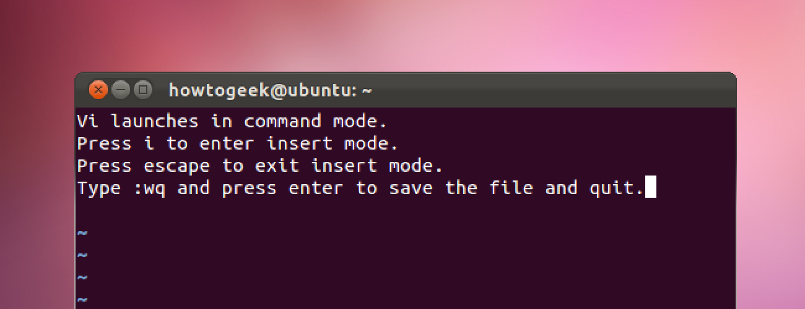
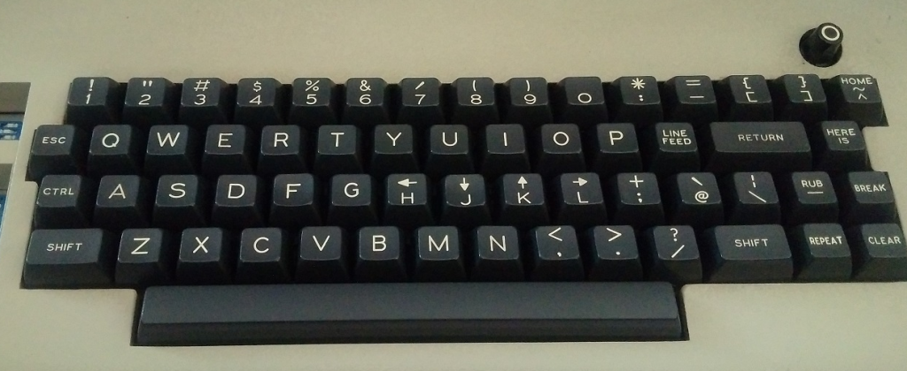

You probably heard of Vim, the almighty text-editor that is everywhere and
a place where [people get trapped from time to time](https://stackoverflow.com/questions/11828270/how-do-i-exit-the-vim-editor).
If you are hearing from your local DevOps engineer how Vim is great and awesome, then you
probably thought about giving it a try. But why do it now? It's 2020, doesn't everyone use
VSCode already?

Well, if you take a look at the
[StackOverflow survey for 2019](https://insights.stackoverflow.com/survey/2019#technology-_-most-popular-development-environments)
about most popular development environments, Vim is still there on the 5th
place, with around 25% of Web Developers using it. This is pretty neat
considering the first Vim release happened almost 30 years ago (yeah, you read
that right, Vim was first released in 1991).

## Brief history of Vim

To better understand why and how Vim got (and is) so popular, it is best to
look into the roots of how it all started. Before `vim` there was `vi`, before
`vi` there was `ed`. But, what are all of these two or three letter words, and
what is the story behind it? Let us dive in and figure out.

### Punch cards and line editors

It might be obvious today why we have text editors and fully-fledged IDE
(Integrated Development Environment), but what did we have before that?
As you may know, early forms of programming involved putting [papers with
holes (punch cards)](https://en.wikipedia.org/wiki/Punched_card) inside a
computer. Order in which you put these in was very important. For example, this
is a picture of 4.5 megabytes data, stacked in 62500 punch cards. Imagine
dropping that and having to stack it again.


<div class="photo-caption">
  OK, mom, I'll come down, just need to re-stack my new blog post
</div>

This proved a bit inefficient as computer power and programming
evolved, and then there came what are called "line editors". One of great
examples of this is a [`ed` editor](<https://en.wikipedia.org/wiki/Ed_(text_editor)>).
If you are on Linux or Mac OS, open your terminal and type `ed` and you
will get a simple line editor. If you are amazed by this finding (as I was), you can write
a file by typing `a` and pressing enter, then write your text. Typing `.`
following an enter will exit the append (insert) mode. Then, to write a file, you can
type `w myfile.txt` and press enter and lastly write `q` and enter to exit.

```
# ed
a
Hey there!
I am using ed right now, how cool.
OK, that's enough.
.
w myfile.txt
64
q
```

As you may notice, there are similarities between working with `ed` and with
today's `vim`.

### Vim's dad - The Vi

After `ed`, then came the `em` - [the "editor for mortals"](http://www.eecs.qmul.ac.uk/~gc/history/).
It could do similar things as `ed`, but it be 'less cryptic' and built for
regular people. Based off of `em`'s code, Bill Joy developed `ex` which
stands for "extended ed"! This was big, because `ex` had, besides the previous
modes, the `visual` mode which will show the whole file on your screen. You
must be thinking - duh, how didn't they [think of that earlier](https://www.bell-labs.com/usr/dmr/www/qed.html)?
Well, to have
that thing show up on computers in those days was pretty tricky and some
considered it a resource hog. But, at that point, the benefits had outweighed
objections and having a file opened on your screen as you edit it became
today's a standard.



And like that the **vi**sual mode was born. Later, the executable `vi` was
introduced in operating systems, but you can still access `ex` commands by
typing `:` in `vi`/`vim`. The `ex` was released in 1976, and the `vi`
executable was released in 1979. 40-something years ago! But, how did `vim` came to life?

### The Imitation Game

Couple of years later, a lot of `vi` clones emerged (my favourite one is
[Elvis](<https://en.wikipedia.org/wiki/Elvis_(text_editor)>)). One of them was "Vi
Improved" which was created by Bram Moolenaar - the name you now see when you
try to open `vim` in your terminal. In the large pool of different `vi` clones,
`vim` managed to stand out. Bram used a clone of `vi` called `STEVIE` (nice
name, BTW), and noticed that it lacks many of `vi`'s commands. He added
some new features and made it compatible with `vi` and released it under
the name "Vi Improved". The name `vim` came in the version 2.0 in 1993 and
stayed like that until present day. But how did `vim` achieve fame? It had a
[bunch of awesome features](<https://en.wikipedia.org/wiki/Vim_(text_editor)#Features_and_improvements_over_vi>)
at that time and it was compatible with `vi`. This attracted a lot of folks to use it.

### Half a century of contributions

If you take a look at the essential commands to move around in Vim: `h`, `j`,
`k`, and `l`, these all pull roots from the old `vi` days. The Bill Joy's
[keyboard at that time](https://en.wikipedia.org/wiki/ADM-3A)
didn't have cursors to move around. Also, the `ESC` key was in the place
of today's `TAB` key. Take a look at how it was back in the day:



Commands to replace text like `:%s/text_to_replace/text_to_replace_it_with/` is
also something from that era. Having to type `:` in order to perform a command
was an answer to `ed`'s complete silence when you enter the editor.

What I am trying to say is that `vim` is an effort of over half a century of
good idea accumulation, putting lots of effort on being backwards compatible.
Yes, good features probably made Vim famous. But what kept Vim in the loop is
the compatibility with almost everything you can think about. Wherever you SSH
today, you can start the Vim session, or at least Vi session. That is definitely
a strong (if not the strongest) point to learn it in nowadays.

If you're not someone who jumps from server to server and navigates files on
there, the point of having Vim everywhere doesn't bother you so much. But
still, there are couple of reasons why it might be valuable to you. Read on
to find out.

## Other sweet pros

Besides being all-present editor, Vim has other pros that people stick for. It
is still 'Vi IMproved' for a reason, let us find out what you get by learning
it.

### The Need for Speed

No, this isn't about the popular racing game series, it is still about editing
files in Vim - which is super fast. But don't let me fool you, editing is super
fast when you get a hang of it, which can happen also pretty fast. It is not a
mere coincidence that majority of popular websites (Facebook, Twitter, Gmail,
Tumblr) allow you to move around with `h`, `j`, `k`, and `l` around the
feed. This is why developers love Vim. Instead of having to use your mouse,
you can use combination of key presses that let you jump around the file with
ease. For example:

- `gg` - jump at the top of the file
- `G` - jump at the bottom of the file
- `{` - move up between empty space or code blocks in your file
- `}` - move down between empty space or code blocks in your file
- `(` - move back onto the previous sentence
- `)` - move forward onto the next sentence


These are just the basic movement tips you can try out in your next Vim
session. I will not go into details how to move around, and how you should
disable arrow keys on the start (you probably should), there are many of
resources for that on the internet. I will just leave you with these couple of
navigation shortcuts for you to try out.

If that is not enough, I have a very [pragmatic](/) advice for you in the next
section.

### Getting closer to the metal

Learning Vim also means learning what is in your Terminal and your machine. To
better paint the picture of what I mean, I'll approach it form the other side
and give you an example of what you usually do with a IDE. When you use an
IDE-like experience, you don't actually need to tinker around much. You get a
theme or a plugin manager, you search for a plugin there, click install and
voilà, you just got yourself a full support for TypeScript.

But, this is a bit different in Vim. Yes, you have a sea of plugins and a vast
community of folks contributing to it. But you can get really deep into
configuration and figuring out how everything works by customizing your Vim
experience. Some plugin has some pros and works well with others, some are so
good with fitting into your current configuration and you have to do a lot of
manual work yourself. So all this time you are learning more about what you have
in your development environment.

For example, to search for text occurrences I used
[ack-grep](http://manpages.ubuntu.com/manpages/trusty/man1/ack-grep.1p.html).
Later on I found that there is a faster approach using [ag](https://github.com/ggreer/the_silver_searcher). Then, there is
an even faster alternative called [ripgrep](https://github.com/BurntSushi/ripgrep).
Of course, I stopped at the `ag`, but my point is that you are encouraged to
learn more about what you have on your machine, and thus have more confidence
and knowledge about what is happening. This is all getting you closer to the
metal (machine) as possible, instead of mindlessly installing plugins from the
IDE's marketplace.

If you want to get a quick glance on what it takes to have
[Vim and TypeScript together, check out this blog post](/ultimate-vim-typescript-setup).

### Final thoughts

Thanks for reading this far, I appreciate it. If you are still wondering
whether to start learning Vim or not, I'd say give it a try. You never know
when you might need it, or you even fully switch to using Vim.

Maybe you get a Vim mode inside your IDE or VSCode, who knows. I am not saying
that Vim should replace what you are using now, but trying to learn and
configure it will definitely improve your skills and abilities. Also, at the
end of the day, it doesn't really matter what editor you use, it is what you do
with it!

At the end of the day, it's the matter of finding the proper editor
(tool) that makes you do what you do even better.

If you liked the blog post, you can share it with your friends and coworkers below:

Consider subscribing to my [newsletter](/newsletter) if you want, you will get
similar blog posts like this one when they get out.

Thanks for reading, catch you in the next one, cheers 🍻
